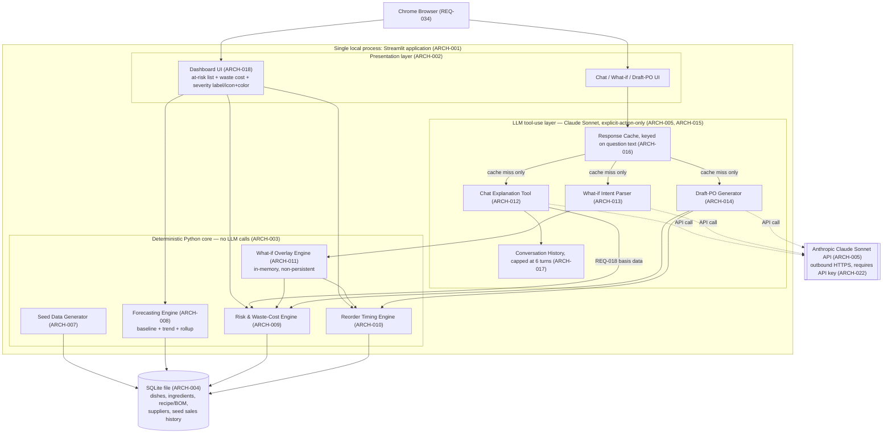

# Solution Architecture — Agentic Ingredient Demand Forecasting Assistant

**Workflow ID:** N/A (standalone PRD input — Shape B, no discovery-pipeline workflow record)
**Agent:** solution-architect-agent
**Created:** 2026-09-17
**Status:** Draft — awaiting human review
**Source artifacts:** `docs/01-prd/prd-ingredient-demand-forecasting.md` (Status: Confirmed, Version 1.0, Last Updated 2026-09-17)
**Human approval status:** PENDING

## Notes on scope

This is a Shape B (standalone PRD) input. There is no `FEAT-XXX` layer for this product — every `ARCH-XXX` item below traces directly to one or more `REQ-XXX` ids from the confirmed PRD, or to the PRD's Constraints section where noted. No feature layer has been invented.

Several technologies are named in the PRD's Constraints section as **client-named technology constraints** (Python, SQLite, Streamlit, Claude Sonnet). Per this agent's hard rules, naming a technology as a constraint in a PRD is not the same as an architect deciding to lock it in — each is still called out below as an assumption requiring explicit human approval before it is treated as an irreversible architectural commitment, alongside the deployment-topology and state-management decisions that follow from it.

---

## Summary diagram

---

## Architecture elements

### ARCH-001 — Deployment topology: single local process, no hosting
Traces to: Constraints ("no infrastructure budget: local SQLite, local Streamlit, no hosting"), REQ-031, REQ-032, REQ-033
Description: The entire application (Streamlit UI, deterministic Python core, LLM tool-use layer, SQLite file) runs as one local process on one machine for the duration of the hackathon build/demo. No load balancer, no separate app/API tier, no remote database, no container orchestration. The only outbound network call is to the Anthropic API.
Rationale: Matches the stated no-infra-budget constraint and the 24–36 hour build window; anything more distributed adds deployment risk with zero benefit at single-kitchen, single-session, demo scale.
Assumptions (flag if irreversible / needs human approval): **Needs human approval.** This is a scope-defining, high-impact decision: it forecloses concurrent multi-user access, any notion of high availability, and any path to a hosted demo without a follow-on re-architecture effort. Confirm the team accepts "runs on one laptop, one demo session, one browser tab" as the actual target before building further layers on top of it.
Scalability/Availability/Observability notes: Not applicable at hackathon/local scope — there is exactly one process, one user, one machine, and no uptime target. If this product moves beyond the hackathon, this decision would need to be revisited before any second concurrent user is supported.

### ARCH-002 — Presentation layer: Streamlit web application
Traces to: Constraints (client-named: Streamlit for the web app), REQ-023, REQ-024, REQ-030, REQ-034
Description: Streamlit renders the dashboard, chat panel, what-if input, and draft-PO output in a single-page, server-rendered web app served locally and viewed in Chrome.
Rationale: Named directly by the client as a constraint; also a reasonable fit for a Python-centric, low-ceremony UI given the build window.
Assumptions (flag if irreversible / needs human approval): **Needs human approval as an irreversible framework commitment**, even though the client named it. Streamlit's execution model (full-script rerun per interaction, session-scoped state) shapes how the what-if overlay (ARCH-011) and conversation history (ARCH-017) must be implemented — swapping frameworks later is not a drop-in change. Flagging so the human sponsor explicitly signs off on Streamlit rather than this being an unreviewed inherited default.
Scalability/Availability/Observability notes: Streamlit's default session model serves one user per session with in-process state; not designed for concurrent multi-user production traffic. Not applicable at hackathon scale (single user, single session). No built-in observability beyond Streamlit's own logs; see ARCH-023.

### ARCH-003 — Deterministic Python computation core (no LLM calls)
Traces to: REQ-025, Constraints (client-named: Python for the deterministic forecasting/risk/waste-cost layer)
Description: A dedicated Python module set (importable, independent of Streamlit) implementing seed generation, forecasting, risk flagging, waste-cost estimation, and reorder timing, with zero dependency on any LLM call. This is the module boundary the UI and the LLM tool-use layer both call into, and the boundary that must remain deterministic per REQ-013.
Rationale: REQ-025 explicitly mandates no LLM involvement in this layer; isolating it as its own module set makes REQ-013's determinism guarantee testable in isolation (same seed data in, identical output every run) independent of UI or LLM behavior.
Assumptions (flag if irreversible / needs human approval): Python as implementation language is named by the client as a constraint and is low-irreversibility (a scripting-language choice for a same-process module, easily rewritten if ever needed) — noted for completeness but not flagged as a high-impact lock-in on its own. The determinism guarantee itself (fixed current-date constant per REQ-009, no hidden randomness/clock reads) is an architectural invariant this module boundary exists to protect, and should be enforced with a unit test that reruns the pipeline twice against unchanged seed data and diffs the output.
Scalability/Availability/Observability notes: Not applicable at hackathon scale — single-process, in-memory computation over a small (15–20 dish, few-ingredient) dataset; expect sub-second execution. No load concerns. Observability: log each computation run's inputs/outputs to a local log file (see ARCH-023) so a "why did the numbers change" question during demo rehearsal can be traced without re-deriving by hand.

### ARCH-004 — Storage: SQLite embedded database
Traces to: REQ-005, REQ-006, REQ-007, REQ-008, REQ-009, REQ-033, Constraints (client-named: SQLite for storage, no infrastructure budget)
Description: A single SQLite file stores the seed sales history, dish catalogue, recipe/BOM mapping, ingredient master (unit, perishable flag, shelf_life_days, unit_cost, supplier_id), and supplier list (lead time, per-unit cost). Loaded once at initialization (REQ-033); no write path exists afterward except at seed time. What-if overlay state is explicitly excluded from this store (see ARCH-011).
Rationale: Matches the client-named storage constraint and the no-infra-budget constraint; SQLite's file-based, zero-server model needs no setup time inside a 24–36 hour build window and is sufficient for a dataset of this size (single kitchen, 15–20 dishes, 3–5 suppliers, 12 weeks of history).
Assumptions (flag if irreversible / needs human approval): **Needs human approval as an irreversible storage-engine commitment**, even though the client named it. SQLite has no built-in concurrent-writer support and no network access model; if this product ever needs a second concurrent user, a hosted deployment, or write-heavy usage, the storage layer would need to be replaced rather than reconfigured. Recommend the schema (table/column names, key relationships) be designed so a future migration to a server-based relational engine is a data-migration exercise, not a data-model rewrite — but that is a forward-looking note, not a v1 requirement.
Scalability/Availability/Observability notes: Not applicable at hackathon scale — a few thousand rows at most, single reader/writer, no concurrent-access contention expected because there is exactly one Streamlit session. No backup/restore or durability guarantees are in scope for v1; if the SQLite file is lost, re-running the seed generator (ARCH-007) reconstructs it deterministically per REQ-009/REQ-013.

### ARCH-005 — LLM layer: Claude Sonnet via Anthropic API, single-turn tool-use
Traces to: REQ-018, REQ-019, REQ-022, REQ-026, REQ-027, REQ-028, REQ-029, Constraints (client-named: Claude Sonnet for the LLM layer)
Description: All natural-language generation and parsing (chat explanations, what-if intent parsing, draft-PO text) is delegated to Claude Sonnet through the Anthropic API in a single-turn, tool-use pattern: each user action produces one request/response exchange, not a multi-step agent loop. No LLM call occurs outside an explicit user action (REQ-028).
Rationale: Client-named constraint; single-turn tool-use keeps behavior predictable and cheap for a low-volume (a few hundred requests) demo period, and matches REQ-026's explicit pattern requirement.
Assumptions (flag if irreversible / needs human approval): **Needs human approval as an irreversible vendor/model commitment.** "Claude Sonnet" names a specific model family from a specific vendor with no fallback chain (explicitly a non-goal) — any Anthropic outage, rate limit, deprecation, or pricing change during the build/demo window has no mitigation path other than the manual-fallback demo recording called out in the PRD's build-phase constraint. This should be signed off as an accepted single-point-of-failure for a hackathon, not silently inherited as a production posture.
Scalability/Availability/Observability notes: Volume is explicitly low (a few hundred requests, no spend cap enforced per the PRD). Availability of the LLM layer is entirely dependent on Anthropic API uptime and network egress from the demo machine — no redundancy is in scope. Observability: log request type (chat/what-if/PO-draft), cache hit/miss, latency, and any API error to a local log (ARCH-023); do not log full prompt/response bodies to persistent storage without a decision from security review (ARCH-022) given supplier cost data may appear in PO-draft prompts.

### ARCH-006 — Core data model: dishes, ingredients, recipe/BOM, suppliers
Traces to: REQ-005, REQ-006, REQ-007, REQ-008
Description: Five logical entities inside the SQLite store: `dish` (name, recipe reference), `ingredient` (unit, perishable flag, shelf_life_days, unit_cost, supplier_id), `recipe_line` (dish-to-ingredient quantity mapping), `supplier` (lead_time_days, and implicitly the per-ingredient unit_cost referenced above), and `sales_history` (dish-level daily/weekly observed sales, synthetic). All ingredient-side quantities and supplier unit costs are expressed in the ingredient's single base unit (REQ-008) — no unit-conversion logic exists or is planned.
Rationale: Directly mirrors the entities and attributes REQ-005 through REQ-008 require to exist and be seed-supplied (never inferred or defaulted per REQ-007).
Assumptions (flag if irreversible / needs human approval): No unit-conversion layer is an explicit non-goal in the PRD, not an architecture-invented gap — flagged here only so it's visible that this data model would need a conversion layer added (not just a column) if that non-goal is ever revisited.
Scalability/Availability/Observability notes: Not applicable at this scale (15–20 dishes, 3–5 suppliers). No indexing strategy beyond SQLite defaults is warranted for a dataset this small.

### ARCH-007 — Seed data generator
Traces to: REQ-001, REQ-002, REQ-003, REQ-004, REQ-009
Description: A one-time, deterministic generation routine that produces 12 weeks of synthetic dish-level sales history against the pinned current-date constant (REQ-009), guaranteeing by construction: at least one dish with a weekend demand spike (REQ-002), at least one perishable ingredient that reaches its spoilage condition within the forecast horizon (REQ-003), and at least one fast-moving ingredient that reaches a stockout condition within the forecast horizon (REQ-004). Runs once at initialization and populates the SQLite store (ARCH-004); has no subsequent write path (REQ-033).
Rationale: These four requirements only hold if the generator is explicitly engineered to hit them (spike, spoilage, stockout) — leaving this to unconstrained randomness risks a demo where no flags ever fire.
Assumptions (flag if irreversible / needs human approval): The generator must be seeded/parameterized (not purely random) so that REQ-002/003/004's guarantees are reproducible; recommend a fixed random seed alongside the fixed current-date constant so REQ-013's determinism extends to initial data generation itself. This is an implementation detail, not flagged as needing separate sign-off beyond ARCH-004's storage commitment.
Scalability/Availability/Observability notes: Not applicable — single run, small output volume, executes well under demo time budgets.

### ARCH-008 — Forecasting engine: baseline, trend adjustment, rollup
Traces to: REQ-010, REQ-011, REQ-012, REQ-013
Description: Computes, per ingredient per weekday, a baseline demand as the median of same-weekday historical observations (minimum six samples, REQ-010); applies a trend adjustment comparing the trailing 2-week mean against the preceding 4-week mean (REQ-011); rolls dish-level forecasts up to ingredient-level projected consumption via the recipe/BOM mapping (REQ-012). Pure function of seed data plus the pinned current-date constant — no randomness, no LLM call, reproducible byte-for-byte across runs (REQ-013).
Rationale: Directly implements the forecasting requirements as specified; keeping it a pure function (inputs: seed data + current-date constant; output: forecast values) is what makes REQ-013's determinism testable.
Assumptions (flag if irreversible / needs human approval): None beyond ARCH-003's general determinism invariant. Note for the human reviewer: the "minimum six same-weekday samples" threshold in REQ-010 constrains what the seed generator (ARCH-007) must produce — 12 weeks of history gives exactly 12 same-weekday samples per dish, comfortably above the floor.
Scalability/Availability/Observability notes: Not applicable at this data volume; recompute cost is negligible. Observability: expose intermediate values (baseline, trend factor, rolled-up total) through the chat explanation path (ARCH-012) so REQ-018's "specific forecast values and risk basis" requirement has real numbers to cite, not a summary.

### ARCH-009 — Risk engine: stockout flagging, spoilage flagging, waste-cost estimation
Traces to: REQ-014, REQ-015, REQ-016
Description: Consumes the forecasting engine's output plus on-hand stock, shelf_life_days, and unit_cost to raise a stockout flag (projected consumption exhausts on-hand stock before the next feasible reorder arrives, REQ-014), a spoilage flag for perishables whose projected time-to-consumption exceeds shelf_life_days (REQ-015), and to attach an estimated waste cost to each spoilage flag from projected unconsumed quantity times unit_cost (REQ-016).
Rationale: Directly implements the risk/waste-cost requirements; keeping this as a separate engine from forecasting (ARCH-008) lets the what-if overlay (ARCH-011) recompute risk against overlaid demand without re-deriving the entire forecast pipeline's baseline/trend logic.
Assumptions (flag if irreversible / needs human approval): None beyond ARCH-003's determinism invariant. Note: "next feasible reorder" in REQ-014 depends on the reorder timing engine (ARCH-010) — these two engines have a data dependency that should be reflected in code structure (risk engine calls reorder-timing, not the reverse, to avoid a cycle).
Scalability/Availability/Observability notes: Not applicable at this data volume. Observability: every flag raised should retain its computed basis (baseline value, trend factor, threshold crossed) so REQ-018's chat explanation can cite it verbatim rather than the LLM inventing a justification.

### ARCH-010 — Reorder timing engine
Traces to: REQ-017
Description: Computes an "order by" date for each flagged ingredient by working backward from when the ingredient is projected to be needed, using that ingredient's supplier lead time (from ARCH-006's supplier entity).
Rationale: Directly implements REQ-017; isolated as its own engine because both the risk engine (ARCH-009, for "next feasible reorder" in stockout logic) and the draft-PO generator (ARCH-014, for the PO's order-by date) depend on it.
Assumptions (flag if irreversible / needs human approval): None identified.
Scalability/Availability/Observability notes: Not applicable at this data volume.

### ARCH-011 — What-if overlay engine (in-memory, non-persistent)
Traces to: REQ-019, REQ-020, REQ-021
Description: Accepts a structured what-if input (dish, date, added demand quantity — produced by the intent-parsing LLM tool, ARCH-013) and recomputes projected consumption, risk flags, waste-cost estimates, and order-by dates against an overlay layered on top of (not written into) the seed data. Overlay state lives only in the Streamlit session's in-memory state and is discarded on page reload (REQ-021); the underlying SQLite store (ARCH-004) is never mutated by a what-if scenario (REQ-020).
Rationale: Directly implements REQ-019 through REQ-021; keeping the overlay as a pure in-memory transform re-using the risk (ARCH-009) and reorder (ARCH-010) engines avoids duplicating that logic for the "what-if" code path.
Assumptions (flag if irreversible / needs human approval): **Needs human approval as an explicit state-management/product-behavior decision**, even though it is directly specified by REQ-021: in-memory-only, reload-resets state means a kitchen manager who explores several what-if scenarios during a demo loses all of them on any accidental refresh, and nothing about a scenario is ever recoverable or auditable after the fact. This is called out so the human sponsor is confirming, not just inheriting, the "no persistence, no history of past what-ifs" behavior as acceptable for v1 — since it is easy to mistake "the PRD said so" for "already reviewed as a product trade-off."
Scalability/Availability/Observability notes: Not applicable — single session, single overlay at a time (no evidence in the PRD of multiple concurrent what-if scenarios being layered). Observability: log each what-if request's parsed parameters (dish, date, quantity) and resulting flag deltas locally, since the overlay itself leaves no trace after reload — this is the only way to reconstruct what happened during a demo rehearsal after the fact.

### ARCH-012 — Chat explanation tool (LLM)
Traces to: REQ-018, REQ-026
Description: A Claude Sonnet tool-use call that, given a "why is [ingredient] flagged" question and the risk engine's retained basis data (ARCH-009) for that ingredient, produces a natural-language explanation citing the specific forecast values and risk basis. The LLM explains pre-computed deterministic output; it does not compute or re-derive the numbers themselves (REQ-025 boundary).
Rationale: Directly implements REQ-018 within the REQ-026 single-turn tool-use pattern; passing the deterministic basis data as tool-call context (rather than asking the LLM to infer it) keeps the explanation numerically consistent with the deterministic core, which matters for a demo where the kitchen manager may cross-check the numbers.
Assumptions (flag if irreversible / needs human approval): None beyond ARCH-005's general LLM-vendor flag. Recommend the human reviewer confirm that "hallucinated" numeric drift (LLM restating a number slightly wrong) is treated as a defect to catch in rehearsal, since REQ-018 requires the *specific* values, not an LLM-paraphrased approximation.
Scalability/Availability/Observability notes: See ARCH-005 and ARCH-016 (cache).

### ARCH-013 — What-if intent parser (LLM)
Traces to: REQ-019, REQ-026
Description: A Claude Sonnet tool-use call that parses a free-text what-if input into the structured (dish, date, quantity) parameters the overlay engine (ARCH-011) requires. This is the one LLM component whose output feeds back into the deterministic core, so its output shape needs a strict, validated schema before being handed to ARCH-011.
Rationale: REQ-019 requires accepting "a what-if input" without specifying its exact surface form; treating natural-language-to-structured-parameters as an LLM tool-use task keeps the input flexible for the kitchen manager while REQ-026 requires this to be Claude Sonnet-based.
Assumptions (flag if irreversible / needs human approval): **Needs human review of the validation boundary, not a technology sign-off.** Because this is the one place an LLM output crosses back into the deterministic core (REQ-025's no-LLM-calls boundary is about computation, not input parsing, so this doesn't violate it, but it does mean malformed or out-of-range LLM parses could feed bad input into deterministic computation). Recommend the overlay engine validate parsed parameters (dish exists in the recipe/BOM, date is within a sane forecast-horizon window, quantity is a positive number) and reject/re-prompt rather than silently computing on garbage input.
Scalability/Availability/Observability notes: See ARCH-005 and ARCH-016 (cache). Observability: log parse failures/rejections distinctly from successful parses, since a string of silent rejections during a demo would look like the what-if feature is broken rather than input being malformed.

### ARCH-014 — Draft-PO generator (LLM)
Traces to: REQ-022, REQ-026
Description: A Claude Sonnet tool-use call that generates a ready-to-send, text/email-style purchase-order line for a flagged ingredient, addressed to that ingredient's supplier, including item, quantity, and order-by date — all sourced from the risk engine (ARCH-009) and reorder timing engine (ARCH-010) outputs, with the LLM responsible for the natural-language framing only.
Rationale: Directly implements REQ-022 within the REQ-026 pattern; as with ARCH-012, deterministic values (item, quantity, order-by date) are passed in as tool-call context rather than left to the LLM to compute, per REQ-025's boundary.
Assumptions (flag if irreversible / needs human approval): None beyond ARCH-005's general LLM-vendor flag. Note: the PRD explicitly scopes this as "not an integration with a procurement system" (glossary) — no email-send capability, API call to a supplier system, or PO persistence exists or is implied by this component; it produces text only.
Scalability/Availability/Observability notes: See ARCH-005 and ARCH-016 (cache).

### ARCH-015 — LLM invocation trigger boundary: explicit user action only
Traces to: REQ-028
Description: An architectural rule enforced at the call site of every LLM tool (ARCH-012, ARCH-013, ARCH-014): they may only be invoked in direct response to a user-initiated action (submitting a chat question, submitting a what-if, requesting a PO draft) — never from page load, a polling loop, or any background schedule.
Rationale: Directly implements REQ-028; also the primary cost/volume control given "no spend cap is enforced in v1" per the PRD's constraints — without this rule, an accidental rerun-on-every-interaction pattern (a known Streamlit pitfall, given ARCH-002's full-script-rerun execution model) could multiply API calls silently.
Assumptions (flag if irreversible / needs human approval): Flagging for implementation-level attention rather than a technology sign-off: because Streamlit reruns the entire script on most widget interactions, the implementation must explicitly gate each LLM call behind a specific button-press/submit event (not merely "code that happens to be near a button"), or REQ-028 and REQ-029 (cache-before-call) both get violated inadvertently.
Scalability/Availability/Observability notes: Not applicable in the scalability sense; this is a cost/behavior control. Observability: log every LLM invocation with its trigger action so a rehearsal review can confirm no invocation ever fired outside an explicit action.

### ARCH-016 — LLM response cache keyed on question text
Traces to: REQ-029
Description: Before any LLM call (ARCH-012/013/014), an in-process cache lookup keyed on the exact question/input text is checked; a hit returns the cached answer without calling the Anthropic API.
Rationale: Directly implements REQ-029; also reduces redundant API cost/latency if the kitchen manager or a rehearsal repeats the same question.
Assumptions (flag if irreversible / needs human approval): The PRD specifies "keyed on question text" literally (not semantic/embedding-based similarity) — flagging so the human reviewer confirms exact-text-match caching is the intended (and sufficient) behavior, since it means trivially reworded questions will not hit the cache and will incur a fresh API call. This is a fidelity-to-spec note, not a technology lock-in.
Scalability/Availability/Observability notes: Not applicable at this scale — cache is in-memory, session-scoped, small (a few hundred entries at most per the stated volume ceiling). Observability: log cache hit/miss alongside each invocation (see ARCH-015) to make cache effectiveness visible during rehearsal.

### ARCH-017 — Conversation history manager
Traces to: REQ-027
Description: Maintains chat conversation history capped at the last 6 turns; older turns are dropped outright (not summarized) when the cap is exceeded.
Rationale: Directly implements REQ-027; keeps prompt size (and therefore cost/latency) bounded for the chat explanation tool (ARCH-012) without adding summarization complexity the build window doesn't allow for.
Assumptions (flag if irreversible / needs human approval): None — this is a direct, unambiguous requirement with no open design choice left to the architecture.
Scalability/Availability/Observability notes: Not applicable at this scale; history lives in Streamlit session state and resets with the session, consistent with the no-persistence posture elsewhere in this design (ARCH-011).

### ARCH-018 — Dashboard UI: at-risk ingredient list with severity signaling
Traces to: REQ-023, REQ-024, REQ-030
Description: The primary Streamlit view lists all currently at-risk ingredients with their waste-cost estimates (REQ-023), conveys severity via a label or icon in addition to color so severity remains legible without color perception (REQ-024), and uses type sizing/contrast suitable for projector/overhead-lit viewing (REQ-030).
Rationale: Directly implements the dashboard requirements; REQ-024 is called out in the PRD as functional (the dashboard's primary signal), not cosmetic, so this is treated as a hard UI constraint rather than a nice-to-have.
Assumptions (flag if irreversible / needs human approval): None architecturally — the specific visual design (icon set, color palette, type scale) is a UI/UX-agent concern, not a solution-architecture decision; this entry establishes that the dashboard component must expose severity as a discrete, labeled value (not merely a color/number) so the UI/UX design has something structured to render.
Scalability/Availability/Observability notes: Not applicable — single view, small list (at most the ingredient count in the seed data).

### ARCH-019 — AuthN/AuthZ posture: no authentication, single implicit tenant
Traces to: REQ-031, REQ-032
Description: The application requires no login or authentication (REQ-031) and supports exactly one kitchen/tenant with no data isolation model (REQ-032). There is no user identity concept anywhere in the system.
Rationale: Directly specified by the PRD as v1 scope; consistent with the single-process, single-session deployment topology (ARCH-001).
Assumptions (flag if irreversible / needs human approval): **This is a security posture, not merely a UX convenience, and is explicitly not decided by this architecture.** Per this agent's mandate, no security/compliance posture is asserted here — flagging for Risk & Compliance / security review: (a) whether running with no auth is acceptable even for a local-only demo machine (e.g., if the demo machine is on a shared network with the Streamlit port reachable by others), and (b) that the PRD's Non-Goals section already notes a *future* production deployment ingesting real POS data would carry transaction/staffing data obligations and supplier-pricing confidentiality — this v1 architecture defers that entirely and should not be read as having cleared it.
Scalability/Availability/Observability notes: Not applicable — no identity, no session isolation beyond the single Streamlit session.

### ARCH-020 — Internal integration pattern: in-process calls only, no network API boundary
Traces to: REQ-025, REQ-026, REQ-031, Non-Goals (no real POS/supplier-catalogue integration)
Description: All communication between the UI (ARCH-002), deterministic core (ARCH-003), and LLM layer (ARCH-005) happens via in-process Python function/module calls — there is no internal REST/RPC API, no service mesh, and no exposed API surface for external systems. The only external network boundary is the outbound call to the Anthropic API (ARCH-005).
Rationale: Consistent with the single-process deployment topology (ARCH-001) and the explicit non-goal of real POS/supplier-catalogue integration; introducing internal network APIs would add complexity with no corresponding requirement.
Assumptions (flag if irreversible / needs human approval): None beyond ARCH-001's topology flag, which this restates at the integration-pattern level for completeness.
Scalability/Availability/Observability notes: Not applicable — no network hops internally, so no internal latency/availability concerns exist.

### ARCH-021 — Client/browser support boundary
Traces to: REQ-034
Description: The application is built and tested only against the current version of Chrome; no other browser is a support target for v1.
Rationale: Directly specified by REQ-034; keeps browser-compatibility testing out of the 24–36 hour build window.
Assumptions (flag if irreversible / needs human approval): None — explicit, unambiguous requirement.
Scalability/Availability/Observability notes: Not applicable.

### ARCH-022 — Secrets management for the Anthropic API key
Traces to: REQ-026 (Claude Sonnet invocation requires an API credential), Constraints ("no infrastructure budget... only cost incurred is Anthropic API usage")
Description: The application needs an Anthropic API key to make any LLM call. This element exists to name the requirement, not to prescribe a mechanism.
Rationale: No requirement in the PRD specifies how the key is supplied or protected; this is a gap the architecture must surface rather than silently fill with a default (e.g., hardcoding it, which would violate this repo's hard rule against committing credentials).
Assumptions (flag if irreversible / needs human approval): **Needs explicit human/security decision before implementation, not decided here.** At minimum, the key must be supplied via an environment variable or local untracked config file, never committed to the repository (per this repo's hard rules on secrets). Beyond that minimum, this architecture does not assert a broader security posture (e.g., key rotation, restricted scopes, rate-limit alerting) — those are Risk & Compliance / security-review items, not resolved here.
Scalability/Availability/Observability notes: Not applicable at hackathon scale beyond ensuring the key is present at process start; no key-rotation or multi-environment secret-store concerns exist for a single local demo run.

### ARCH-023 — Observability approach: local logging only
Traces to: Constraints (no infrastructure budget), cross-cutting support for REQ-013 (determinism verification), REQ-018 (citing forecast basis), REQ-028/REQ-029 (invocation and cache visibility)
Description: All logging (deterministic-core computation traces, LLM invocation/cache/error events, what-if requests) is written to a local log file or console output on the demo machine. No centralized log aggregation, metrics dashboard, tracing system, or alerting exists or is proposed.
Rationale: Matches the no-infrastructure-budget constraint and the single-machine deployment topology (ARCH-001); a full observability stack would be disproportionate to a 24–36 hour, single-session build.
Assumptions (flag if irreversible / needs human approval): None as a technology lock-in — local logging is low-cost to change later. Flagging only as an explicit scope statement: **this repo's own hard rule against fabricating metrics means any post-hoc claim about the demo (e.g., "the system correctly flagged N ingredients") should be backed by these logs, not asserted from memory.**
Scalability/Availability/Observability notes: Explicitly not applicable beyond local, single-run logging — there is no infrastructure to monitor, no uptime SLA, and no multi-instance behavior to trace. If this product is ever taken beyond the hackathon, structured logging plus a real observability stack would need to be designed at that time; this architecture does not attempt to anticipate that.

---

## Open items carried into this architecture (not resolved here)

- OQ-1 (PRD): no response-time target set for dashboard/chat/what-if latency — this architecture makes no performance claims and none of the ARCH items above assert a latency SLA.
- OQ-2 (PRD): no numeric waste/stockout-reduction baseline — not an architecture concern, noted for traceability only.
- Security/compliance posture (ARCH-019, ARCH-022) is explicitly deferred to Risk & Compliance / security review, not decided by this architecture.
- Technology and topology choices flagged throughout (ARCH-001, ARCH-002, ARCH-004, ARCH-005, ARCH-011) require explicit human sign-off before being treated as final/irreversible commitments, notwithstanding that several were named by the client as constraints.
