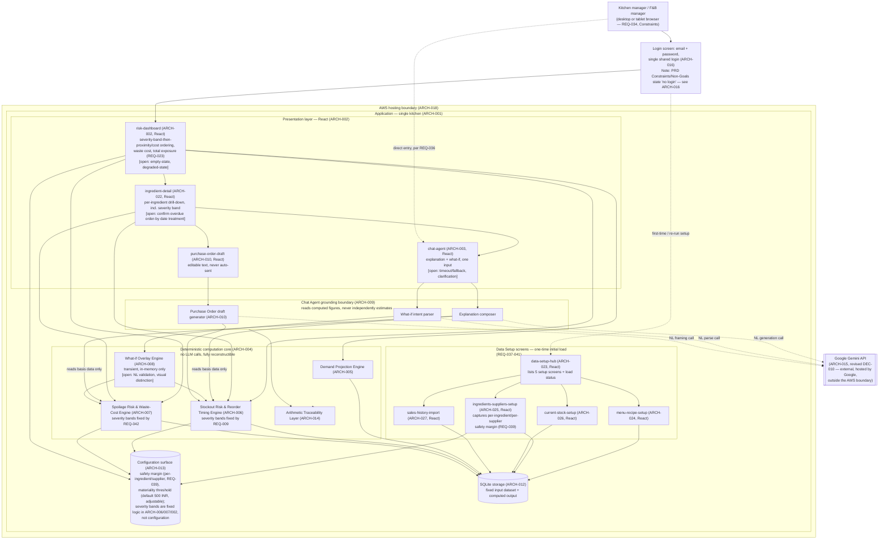

# Solution Architecture — Agentic Ingredient Demand Forecasting Assistant

**Workflow ID:** N/A (standalone PRD input — Shape B, no discovery-pipeline workflow record)
**Agent:** solution-architect-agent
**Created:** 2026-09-17
**Last Updated:** 2026-09-17
**Status:** Approved
**Source artifact:** `docs/01-prd/prd-ingredient-demand-forecasting.md` — Version 1.3, Status: Confirmed, Last Updated 2026-09-17
**Source PRD provenance:** Synced from Confluence page "PRD - Agentic Ingredient Demand Forecasting Assistant" (id `5883461703`, space `~712020c78d0510dbf248218881c00989970857`), resolved via `confluence-doc-resolver` Mode `keyword_status` (keyword "PRD", required status Approved/Confirmed), invoked via `/generate-architecture`. The earlier v1.0 sibling page (id `5884510209`, Status: Confirmed) has since been deleted and is not a valid source for this architecture.
**Additional input — User Journeys:** Confluence page "Ingredient Demand Forecasting Assistant User Journeys" (id `5884608515`, space `~712020c78d0510dbf248218881c00989970857`), source of truth `docs/01b-user-journey/journeys.md` at v1.0 (Confirmed). That local file does not exist in this repo checkout; the Confluence page content, fetched directly via MCP, is the only available copy and is treated as authoritative. Screen names used below (`risk-dashboard`, `ingredient-detail`, `chat-agent`, `purchase-order-draft`) are the journeys doc's own proposed working names — final naming is owned by the design stage (`docs/04-design`), not by this architecture. The journeys doc does not name working screens for the Data Setup elements (ARCH-023–ARCH-027); the working names used for those five elements are this document's own proposal and should be confirmed at the design stage like the others.
**Human approval status:** APPROVED (Gate ARCH-1, approved 2026-09-17 — see DEC-005, `workflow/decisions.md`). The irreversible technology choices (React/ARCH-002, SQLite/ARCH-012, self-hosted Gemma 4B/ARCH-015, AWS/ARCH-018) and the AuthN/AuthZ posture (ARCH-016), including the discrepancy it creates against the PRD's stated Constraints/Non-Goals, were each addressed at this gate. That discrepancy remains open and deferred to a future PRD-amendment run — approval of this document does not resolve it.

**Revision note (DEC-010, 2026-09-17):** ARCH-015's self-hosted-Gemma decision (and ARCH-017's "zero external dependencies" conclusion that depended on it) is superseded by a later, direct human decision to use the external Gemini API instead. This was decided in the same session as, and after, the infrastructure work (DEC-008/DEC-009, `workflow/decisions.md`) that first surfaced the change at the Terraform layer — this document is being updated to bring the engineering architecture back in sync with what's actually being built. See ARCH-015/ARCH-017 below and DEC-010 for the full rationale; this is a genuine architecture change, not a Gate ARCH-1 re-approval — the original Gate ARCH-1 record (DEC-005) is left intact as history.

## Notes on scope

This is a Shape B (standalone PRD) input. There is no `FEAT-XXX` layer for this product — every `ARCH-XXX` item below traces directly to one or more `REQ-XXX` ids from the Confirmed PRD, to the PRD's Constraints / Non-Goals / Open Questions sections, to the User Journeys page, or to an explicit human decision (Gate ARCH-1), where a requirement id alone doesn't capture the driver. No feature layer has been invented.

The PRD's Constraints section names no specific technology. The technology and hosting choices below — SQLite (ARCH-012), self-hosted Gemma 4B (ARCH-015), AWS (ARCH-018), React (ARCH-002), and the email+password login posture (ARCH-016) — are explicit human decisions, not inferred or inherited from the PRD, and remain flagged for explicit human approval (see Human approval status). What remains open beyond those is narrower, implementation-level follow-on decisions — see Open Items.

---

## Summary diagram

---

## Architecture elements

### ARCH-001 — Overall system shape: single-tenant, single-kitchen application
Traces to: Constraints ("Single user, no login, no roles"; "Platform: desktop or tablet browser only"), Non-Goals ("Multi-site operation — one kitchen only", "Accounts and permissions — single user, no login, no roles", "Mobile-specific interface — desktop or tablet browser is sufficient"), ARCH-016 (login)
Description: The system serves exactly one kitchen, with no tenant/account model and no mobile-optimized surface. It is a browser-delivered application (desktop or tablet), not a native app. Access to that single kitchen's data is gated by a single shared login (ARCH-016) rather than being open with no login at all — the system remains single-tenant and single-role, but requires login (see ARCH-016 for the discrepancy this creates against the PRD's literal text).
Rationale: The single-kitchen, single-role, non-mobile boundaries are stated directly and repeatedly in the PRD (Constraints and Non-Goals agree), so the architecture should not build any multi-tenant, multi-user, or native-mobile scaffolding that nothing in the PRD asks for. The login requirement is a separate, explicit decision (ARCH-016) layered on top of this boundary, not a change to the single-tenant shape itself.
Assumptions (flag if irreversible / needs human approval): Low risk as stated — this narrows scope rather than locking in technology. Flagging only that if this product is ever extended to a second kitchen or a second concurrent user, most components below (ARCH-011/ARCH-012 data model, ARCH-016 authN/authZ posture) would need revisiting; that is out of scope for v1 but should not be silently assumed away. See ARCH-016 for the discrepancy this login decision creates against the PRD's literal "no login" text.
Scalability/Availability/Observability notes: Scale target is fixed at one kitchen, one active session at a time — no concurrency or horizontal-scaling design is warranted for v1. Availability target is not stated by the PRD (see ARCH-019); do not assume an SLA.

### ARCH-002 — Risk Dashboard (`risk-dashboard`) — presentation layer (React)
Traces to: REQ-023, REQ-024, REQ-025, REQ-026, REQ-027, REQ-032, REQ-034, REQ-042, Constraints ("Platform: desktop or tablet browser only"), User Journeys (`journey-kitchen-manager-manage-stockout-risk`, `journey-kitchen-manager-manage-spoilage-risk`, `journey-fb-manager-review-aggregate-exposure`), OQ-3, OQ-4, OQ-5
Description: A single dashboard view listing every at-risk ingredient — stockout and spoilage interleaved — ordered by severity band first (all Critical items before all High items before all Low items), then within a band by proximity to the order-by date (soonest first, for stockout) or by estimated waste cost (highest first, for spoilage); a Critical spoilage item outranks a High stockout item (REQ-023). The dashboard shows risk type — stockout or spoilage (REQ-024), order-by date for stockout-risk items (REQ-025), and for spoilage-risk items both the estimated waste cost and its assigned severity band (REQ-026, REQ-042), plus one aggregate total-waste-exposure figure that sums every spoilage warning's estimated waste cost, including those suppressed from the visible list by the materiality threshold, not only the warnings currently displayed (REQ-027). Severity is communicated by a named text label — Critical, High, or Low — in addition to colour, so it stays legible under overhead kitchen light and on projected screens where colour distinctions collapse (REQ-034). Per the User Journeys doc, the working screen name for this view is `risk-dashboard`; both kitchen-manager and F&B-manager journeys begin and end here. Drill-down into a single ingredient's detail is handled by a separate screen — see ARCH-022. The presentation layer, including this dashboard, is built in React.
Rationale: Directly implements the dashboard requirement cluster; REQ-034 is called out in the PRD as a legibility/functional requirement, not a cosmetic one, so it is treated here as a hard rendering constraint (severity must be a discrete labeled value the UI renders, not color alone). React is a human-decided technology choice for the presentation layer (see Assumptions). The ordering, aggregation, and severity-labeling rules (REQ-023, REQ-026, REQ-027, REQ-034, REQ-042) are implemented exactly as the PRD states them.
Assumptions (flag if irreversible / needs human approval): **React is the presentation-layer framework** — a technology choice flagged for explicit human approval (see Human approval status). One direct, already-implied consequence follows from this choice: React frontends are client-rendered, so this dashboard (and the other presentation-layer screens — ARCH-022, ARCH-003, ARCH-010, and the Data Setup screens ARCH-023–027) call a defined backend API exposing the deterministic core's (ARCH-004) output and SQLite-backed data (ARCH-012), rather than being server-rendered directly against the core. The specific backend framework/language, any state-management library, and build tooling remain undecided and are not invented here. In addition, the User Journeys doc surfaces two gaps in this screen's behavior that this architecture does not resolve but must not drop: (a) **no defined empty-state** for the case where the kitchen is fully healthy and there are zero at-risk ingredients — the aggregate figure and the list both have undefined behavior in that case (affects REQ-023, REQ-027); (b) **no defined degraded/stale-data state** if this screen misses its REQ-032 load-time target — it's unspecified whether a slow load shows stale cached data, a loading indicator, or an error. Both remain product/UX decisions needed before this screen can be considered fully specified, not architecture-level gaps this document can close on its own.
Scalability/Availability/Observability notes: Data volume is small (15–20 dishes, 30–40 ingredients per Input Data), so rendering performance is not a scaling concern; REQ-032's "materially faster than chat" requirement is a UX/latency-budget constraint, not a scale constraint — satisfied by keeping the dashboard's data path entirely within the deterministic core (ARCH-004) reading from SQLite (ARCH-012), never behind an LLM call, and reached from React only via the backend API boundary noted above. The degraded-state gap noted above interacts with ARCH-012's SQLite read path and ARCH-019's latency budget once a decision is made.

### ARCH-003 — Chat Agent (`chat-agent`): single conversational surface for explanation and what-if
Traces to: REQ-013, REQ-017, REQ-036, REQ-033, User Journeys (`journey-kitchen-manager-manage-stockout-risk`, `journey-kitchen-manager-manage-spoilage-risk`, `journey-kitchen-manager-test-menu-change`, cross-cutting Gaps)
Description: One conversational input surface serves two capabilities — interrogating any dashboard warning in natural language (REQ-013) and posing a hypothetical demand change in natural language (REQ-017) — per REQ-036's explicit requirement that both be accessible through the same Chat Agent interface rather than two disconnected inputs. Every response is returned within a few seconds (REQ-033). Per the journeys doc, the working screen name is `chat-agent`; it is reached both from `ingredient-detail` (asking "why flagged") and directly from `risk-dashboard` (posing a what-if, per `journey-kitchen-manager-test-menu-change`), consistent with REQ-036's single-surface requirement. Like the rest of the presentation layer, this surface is built in React (ARCH-002).
Rationale: REQ-036 is unambiguous that this must be one surface, not two; keeping explanation and what-if intent recognition behind a shared entry point (with routing to the appropriate downstream component, ARCH-009/ARCH-008) is the direct implementation of that requirement.
Assumptions (flag if irreversible / needs human approval): The mechanism for distinguishing an "explain this warning" question from a "what-if" question within one free-text input (intent classification) remains an implementation detail left open by the PRD. Two additional gaps are named explicitly and repeatedly in the User Journeys doc (as a cross-cutting gap affecting all three kitchen-manager journeys) and must be carried forward as open items rather than assumed away: (a) **no defined timeout/fallback behavior** if the Chat Agent does not return within REQ-033's "a few seconds" — no retry, timeout, or partial-answer behavior is specified anywhere; (b) **no defined clarification/validation behavior** for an unparseable, ambiguous, or out-of-scope question (e.g., referencing a dish not on the menu, an out-of-range date, or a question the system cannot map to any warning). Both are product/UX decisions, not purely technical ones, and both should be resolved before REQ-033 and REQ-013/017 can be considered fully specified for acceptance testing. See also ARCH-008 (what-if-specific instance of gap (b)) and ARCH-009 (grounding boundary implications) and ARCH-019 (latency budget).
Scalability/Availability/Observability notes: Volume is bounded by a single kitchen manager's usage pattern (a few sessions per week per Target Users); no concurrency design needed. See ARCH-019 for the REQ-033 latency budget and ARCH-020 for logging.

### ARCH-004 — Deterministic computation core (no LLM calls, fully reconstructible)
Traces to: REQ-028, REQ-029, REQ-030, REQ-031
Description: A module boundary — projection, stockout risk, spoilage risk, reorder timing, and their supporting arithmetic — that runs with zero dependency on any language-model call and produces identical output on every run given the same input data (REQ-028). Every figure this core produces (stockout date, order-by date, order quantity, waste cost, aggregate exposure) must be reconstructible as an explicit arithmetic trace back to the underlying input data (REQ-029). Nothing outside this boundary — including the Chat Agent — computes or independently estimates a quantity that isn't already produced and shown by this core (REQ-030); anything the Chat Agent narrates must be numerically identical to what this core produced for the same warning (REQ-031). This core reads its input data from, and writes its computed output to, the SQLite storage layer (ARCH-012).
Rationale: REQ-028 through REQ-031 together define a hard non-negotiable boundary: computation happens once, deterministically, in one place, and every other component (dashboard, chat, PO draft) only ever reads and narrates that computation's output. Structuring the system around this boundary is what makes REQ-031's cross-surface numerical consistency achievable rather than an emergent hope.
Assumptions (flag if irreversible / needs human approval): The determinism guarantee (REQ-028) implies no hidden non-determinism sources (system clock reads without pinning, unseeded randomness, floating-point order-of-operation drift). This should be enforced with a repeatability test (rerun the pipeline twice against unchanged input data and diff the output) before acceptance — an implementation/test-strategy concern, not a technology lock-in. SQLite's single-writer model (ARCH-012) is naturally compatible with this determinism requirement at the stated single-session usage volume — noted as a coherence check on the storage decision, not a new risk it introduces.
Scalability/Availability/Observability notes: Input data volume is small (12 weeks of daily sales across 15–20 dishes, 30–40 ingredients); compute cost is negligible regardless of implementation technology. Observability: see ARCH-020 — every computation run's inputs/outputs should be logged so REQ-029's "reconstructible arithmetic trace" is something a reviewer can actually inspect, not just a design intention.

### ARCH-005 — Ingredient demand projection engine
Traces to: REQ-001, REQ-002, REQ-003, REQ-004
Description: Projects demand for every ingredient over a forward horizon of at least 14 days (REQ-001), reflecting day-of-week patterns rather than a flat daily average (REQ-002) and weighting recent trend movement more heavily than older history (REQ-003). Ingredient-level projections are derived by mapping each dish's projected demand through its recipe and summing across every dish containing that ingredient (REQ-004) — i.e., this engine consumes dish-level projections and the recipe/BOM mapping (ARCH-011) as inputs.
Rationale: Directly implements the demand-projection requirement cluster in the order the PRD states it: dish-level pattern-aware projection first, then roll-up through the recipe to ingredient level.
Assumptions (flag if irreversible / needs human approval): The specific statistical method for day-of-week pattern recognition and recency weighting (e.g., weighted moving average vs. a formal time-series model) is not specified by the PRD beyond the two stated properties (REQ-002, REQ-003) and the Constraint that the projection need only be "directionally useful, not precise to the gram." This is a modeling choice, not an irreversible technology lock-in, but should be reviewed against the 12-week/15–20-dish data volume (Input Data) to confirm the chosen method is meaningfully calibratable on that little history.
Scalability/Availability/Observability notes: Not a scaling concern at this data volume. Observability: intermediate values (per-weekday baseline, trend factor, rolled-up ingredient total) should be retained and exposed to the Chat Agent's explanation composer (ARCH-009) so REQ-014's "relative contribution per dish" and REQ-015's "relevant dates" have real numbers to cite rather than a paraphrase.

### ARCH-006 — Stockout risk & reorder timing engine
Traces to: REQ-005, REQ-006, REQ-007, REQ-008, REQ-009, REQ-039, User Journeys (`journey-kitchen-manager-manage-stockout-risk`), OQ-1, OQ-4
Description: For each ingredient, determines whether projected consumption will exhaust current stock within the forward horizon (REQ-005); if so, computes the projected stockout date (REQ-006); computes an order-by date earlier than that stockout date by the ingredient's supplier lead time plus a safety margin — a configurable value looked up per ingredient or per supplier, captured during Ingredients & Suppliers data setup (REQ-039, ARCH-025), rather than a single fixed global constant (REQ-007); computes a suggested order quantity covering projected consumption across the lead-time gap (REQ-008); and assigns a severity band — Critical (order-by date ≤2 days away), High (3–7 days away), or Low (more than 7 days away) — driven by how soon the order-by date falls (REQ-009).
Rationale: Directly implements the full stockout-risk requirement cluster as one cohesive engine, since REQ-006 through REQ-009 are a sequential derivation from REQ-005's flag (stockout date → order-by date → order quantity → severity), each depending on the previous. The safety-margin and severity-band values are implemented exactly as the PRD states them.
Assumptions (flag if irreversible / needs human approval): REQ-007's safety margin (OQ-1) is a configurable per-ingredient/per-supplier value captured during data setup (REQ-039, see ARCH-025) rather than a single global constant — this engine reads it as configuration (ARCH-013). REQ-009's severity thresholds (OQ-4) are fixed at Critical ≤2 days / High 3–7 days / Low >7 days. These specific day thresholds are stated directly in the PRD text, not left to the configuration surface (ARCH-013) to define, so they are implemented as fixed application logic in this engine, not as swappable configuration. The User Journeys doc's named gap — a stockout ingredient whose order-by date has already passed by view-time having no distinct treatment — is arguably addressed by construction now that Critical is defined as "order-by date ≤2 days away" (a value of zero or negative days-away, i.e., already overdue, still satisfies "≤2 days"), but the PRD does not explicitly name the overdue case, so this document treats that as *likely* resolved rather than a confirmed one, and flags it for verification during test-strategy/acceptance rather than closing it. See ARCH-002's severity rendering and ARCH-022's detail view for where this still matters.
Scalability/Availability/Observability notes: Not a scaling concern at this data volume (30–40 ingredients). Observability: retain the computed basis (stockout date, lead time, safety margin applied, order quantity derivation) per ingredient so the Chat Agent's explanation (ARCH-009) can state the exact supplier lead time driving the order-by date, per REQ-016. The configured safety-margin value in effect for each computation run should be logged alongside the other basis data (ARCH-020, ARCH-013), since it is a per-ingredient/per-supplier configurable value rather than a fixed constant.

### ARCH-007 — Spoilage risk & waste-cost engine
Traces to: REQ-010, REQ-011, REQ-012, REQ-042, User Journeys (`journey-kitchen-manager-manage-spoilage-risk`), OQ-2, OQ-3, OQ-5
Description: For each perishable ingredient, determines whether stock on hand is unlikely to be consumed before its use-by date given projected consumption (REQ-010); for each ingredient so flagged, computes an estimated waste cost in INR as unconsumed quantity valued at unit cost (REQ-011); suppresses from view any spoilage warning whose estimated waste cost falls below a configurable materiality threshold, defaulting to ₹500 INR and user-adjustable by the kitchen manager (REQ-012); and assigns a severity band — Critical (estimated waste cost ≥₹2000), High (₹500–1999), or Low (under ₹500) — per REQ-042.
Rationale: Directly implements the spoilage-risk requirement cluster; kept as a separate engine from stockout risk (ARCH-006) because the two flag types have independent triggering logic (use-by date vs. supplier lead time) even though both feed the same dashboard and Chat Agent. Severity assignment (REQ-042) is included in this engine's scope, alongside waste-cost computation, since both are computed from the same unconsumed-quantity/unit-cost figures.
Assumptions (flag if irreversible / needs human approval): REQ-012's materiality threshold (OQ-2) has a stated default of ₹500 INR, user-adjustable by the kitchen manager — implemented as configuration (ARCH-013), not a hardcoded constant, since the PRD itself calls it user-adjustable. OQ-3 (whether REQ-027's dashboard aggregate includes suppressed warnings) resolves to yes — the aggregate sums every spoilage warning's estimated waste cost, including those suppressed from the visible list by this engine's materiality threshold — so this engine's output must expose both the suppressed and displayed sets to whatever computes REQ-027's aggregate (ARCH-002), not only the subset that passes the threshold. REQ-042's severity band (Critical ≥₹2000 / High ₹500–1999 / Low <₹500, OQ-5) is a fixed, PRD-stated threshold — unlike the materiality threshold, it is not described as configurable or user-adjustable anywhere in the PRD — and is implemented as fixed application logic in this engine, not as a row in the configuration surface (ARCH-013).
Scalability/Availability/Observability notes: Not a scaling concern. Observability: retain per-ingredient the projected unconsumed quantity, unit cost, use-by date, and assigned severity band so the explanation composer (ARCH-009) can cite the rupee estimate, its severity, and the use-by date driving it, per Success Metrics step 2.

### ARCH-008 — What-if scenario overlay engine (transient, in-memory only)
Traces to: REQ-017, REQ-018, REQ-019, REQ-020, Non-Goals ("Scenario persistence — what-if results are transient; no saving, naming or comparing of scenarios"), User Journeys (`journey-kitchen-manager-test-menu-change`)
Description: Accepts a structured hypothetical demand change (dish, added/altered serving count, date or date range) — produced by parsing the manager's natural-language what-if statement (ARCH-009) — and recomputes, against an overlay layered on top of (not written into) the underlying data: which ingredients newly become at-risk (REQ-018), which order-by dates move (REQ-019), and how total waste exposure changes (REQ-020). The overlay and its results exist only for the current interaction; nothing is saved, named, or made comparable across sessions, per the explicit Non-Goal. Per the journeys doc, the resulting scenario-adjusted view is reflected back on `risk-dashboard` transiently.
Rationale: Directly implements the what-if requirement cluster while honoring the "no scenario persistence" Non-Goal; reusing the stockout (ARCH-006) and spoilage (ARCH-007) engines against overlaid input avoids building a second, divergent risk-computation path for the what-if case.
Assumptions (flag if irreversible / needs human approval): The Non-Goal's "transient, no saving" behavior means a manager who explores several what-if scenarios has no way to recover or compare them after the fact, and no record survives a page reload or session end. This is directly specified by the PRD (not an architecture invention), but is flagged here so the human sponsor is explicitly confirming — not merely inheriting — that this is acceptable product behavior for v1. Two additional gaps are named explicitly by the User Journeys doc and must be carried forward rather than assumed away: (a) **no defined validation or clarifying-question behavior** for ambiguous phrasing, a dish not on the menu, or an out-of-range date in a what-if statement (this is the what-if-specific instance of the same class of gap flagged for ARCH-003/ARCH-009 generally); (b) **how the "scenario-adjusted view" is visually distinguished from real data on `risk-dashboard` is explicitly left to the design stage, not specified as a requirement** — the journeys doc flags this precisely so the dashboard isn't assumed to silently and permanently change when a what-if is active. This architecture's obligation, given (b), is a data-contract one: this engine's output must be clearly tagged as scenario-derived (not persisted, not identical to the underlying real data) in whatever it hands back to the presentation layer, so that the React UI (ARCH-002) has the hook it needs to render the distinction — the visual treatment itself remains a design-stage decision, not decided here.
Scalability/Availability/Observability notes: Single overlay at a time is sufficient — the PRD gives no indication multiple concurrent what-if scenarios need to be layered simultaneously. Observability: log each what-if request's parsed parameters and resulting deltas (ARCH-020), since the overlay itself leaves no other trace — this is the only way to reconstruct what happened during a demo or review session after the fact.

### ARCH-009 — Chat Agent grounding boundary: reads computed figures, never independently estimates
Traces to: REQ-013, REQ-014, REQ-015, REQ-016, REQ-030, REQ-031, REQ-036
Description: An architectural rule enforced at every point the Chat Agent generates natural language: it may only narrate figures already produced by the deterministic core (ARCH-004/005/006/007) — naming the contributing dishes and each one's relative contribution (REQ-014), stating the relevant dates driving the flag (REQ-015), and for stockout flags, stating the supplier lead time that set the order-by date (REQ-016) — and must never independently compute or estimate a quantity not already shown elsewhere (REQ-030). This is what makes an explanation numerically consistent with the dashboard figures for that same warning (REQ-031), which is the specific bar Success Metrics step 3 and 5 hold this product to.
Rationale: REQ-030 and REQ-031 are the two requirements that most directly distinguish this product from "an LLM summarizing a spreadsheet" — the PRD is explicit that a vague or inconsistent answer at the explanation or what-if step fails acceptance regardless of dashboard quality. Making this a named, testable boundary (not an implicit hope) is the point of this element.
Assumptions (flag if irreversible / needs human approval): Enforcing this boundary in practice depends on the explanation-generation call being given the deterministic core's basis data as explicit input context (not asked to "figure it out"), and on validating that the language model's restatement of a number is byte-for-byte or rounding-consistent with the source figure. This validation approach is a test-strategy concern (recommend an automated check that diffs any number appearing in a generated explanation against the dashboard's stored value for that same warning) rather than an irreversible architecture decision. This grounding boundary also inherits ARCH-003's two open gaps (no defined timeout/fallback, no defined clarification for unparseable input) — a timeout or an unparseable question both represent cases where this boundary's "narrate only computed figures" rule needs a defined behavior for producing *no* figure at all, which is not yet specified.
Scalability/Availability/Observability notes: See ARCH-015 (LLM provider) and ARCH-020 (logging). No scale concern at stated usage volumes.

### ARCH-010 — Purchase order draft generator (`purchase-order-draft`)
Traces to: REQ-021, REQ-022, Non-Goals ("Procurement integration — no connection to any supplier portal, EDI channel or ordering system. Orders are drafted as text only.")
Description: For any ingredient flagged at stockout risk, produces a purchase-order draft containing the supplier's name, the item, the suggested quantity, and the required delivery date (REQ-021) — all values sourced from the stockout engine (ARCH-006), with natural-language framing only. The draft is presented as editable text for the manager to review and modify before sending through their own channel; it is never sent automatically (REQ-022). Per the User Journeys doc, this is reached from `ingredient-detail` and its working screen name is `purchase-order-draft`; this screen, like the rest of the presentation layer, is built in React (ARCH-002).
Rationale: Directly implements the PO-drafting requirement within the explicit "text only, no integration" Non-Goal boundary — there is no supplier API, EDI channel, or send capability anywhere in this design.
Assumptions (flag if irreversible / needs human approval): None beyond ARCH-015's general LLM-provider notes (this component makes an NL-generation call). Explicitly noting for completeness: no email-send, no procurement-system API call, and no PO persistence exist or are implied — text output only, matching the Non-Goal precisely.
Scalability/Availability/Observability notes: See ARCH-015 and ARCH-020. Not a scaling concern.

### ARCH-011 — Fixed input dataset ingestion & data model
Traces to: Input Data (sales history, menu, recipes, ingredients, current stock, suppliers), Constraints ("Data is supplied, not sourced"; unit consistency guaranteed by the client), Non-Goals ("Ongoing data entry"; "Unit conversion"), ARCH-012 (SQLite), REQ-037–REQ-041 (Data Setup screens — see ARCH-023–ARCH-027)
Description: A data model covering the six supplied inputs — daily sales history per dish (12 weeks), menu (15–20 dishes), recipes (ingredient quantities per serving, 30–40 distinct ingredients), ingredients (unit, unit cost, perishable flag, shelf life), current stock (quantity on hand, use-by date per ingredient), and suppliers (3–5, each with a lead time, one supplier per ingredient) — loaded once from the fixed, supplied dataset. This one-time initial load has five dedicated setup screens (ARCH-023 hub, plus ARCH-024 Menu & Recipe, ARCH-025 Ingredients & Suppliers, ARCH-026 Current Stock, and ARCH-027 Sales History Import — REQ-037–REQ-041), distinct from the ongoing/day-to-day entry that remains excluded. With ARCH-012 (SQLite), this data model has a concrete target: a SQLite schema holding these six inputs plus the deterministic core's computed output. No screens exist for *ongoing* data entry — logging daily sales, receiving deliveries, or recording stock counts on a recurring basis (Non-Goal — the one-time initial load is in scope; only recurring/day-to-day entry is excluded) — and no unit-conversion logic exists anywhere in the model, since unit consistency across recipe quantities and supplier pricing is guaranteed by the client, not derived (explicit Non-Goal).
Rationale: Mirrors the Input Data section's itemized breakdown exactly; the absence of an *ongoing* data-entry UI and a conversion layer are both explicit Non-Goals, not architecture-invented gaps, so this element documents that absence rather than silently filling it. The one-time initial load itself is in scope, covered by ARCH-023–027.
Assumptions (flag if irreversible / needs human approval): If the "unit consistency guaranteed by the client" assumption is ever wrong for real data (as opposed to the fixed dataset used for this build), figures computed downstream (REQ-008 suggested order quantity, REQ-011 waste cost) would be silently wrong with no validation layer to catch it, since no conversion/validation logic is in scope. Flagging this as a data-quality risk inherited directly from the Constraint, not something this architecture can mitigate without contradicting the stated Non-Goal — worth a light input-validation check (e.g., a SQLite-level check constraint confirming declared units match across recipe and supplier records) even though full conversion remains explicitly out of scope. This check is a natural fit for the setup screens (ARCH-024–027) that perform the one-time load.
Scalability/Availability/Observability notes: Data volume is small and fixed for the life of this build (a few thousand rows at most) — comfortably within SQLite's envelope. No ongoing ingestion pipeline is needed since there is no ongoing data entry beyond the one-time setup load covered by ARCH-023–027.

### ARCH-012 — Storage layer: SQLite
Traces to: REQ-028 (determinism depends on stable, unmutated input data across runs), REQ-032, REQ-033, Constraints ("Data is supplied, not sourced"), human decision (Gate ARCH-1)
Description: **SQLite is the storage technology**, holding the fixed input dataset (ARCH-011), the deterministic core's computed output (ARCH-004), the arithmetic trace (ARCH-014), and the configuration surface (ARCH-013) for the dashboard, ingredient-detail screen, Data Setup screens, and Chat Agent to read from.
Rationale: SQLite is a single-file, embedded, serverless database engine well matched to this system's small, fixed data volume (a few thousand rows), single-active-session usage pattern (ARCH-001), and read-heavy access pattern from the dashboard/chat/PO-draft paths — a fit confirmed by the human reviewer rather than one this architecture invents post hoc.
Assumptions (flag if irreversible / needs human approval): **SQLite is an irreversible technology choice, requiring explicit human approval** (see Human approval status). Noting downstream consequences that follow from it, rather than new decisions being made here: (a) SQLite's single-writer model is consistent with ARCH-001's single-kitchen/single-session scope and poses no concurrency risk at this usage volume; (b) under AWS hosting (ARCH-018), SQLite implies the application needs a compute environment with an attached, persistent, durable disk, rather than a stateless/ephemeral-compute or fully managed relational-database service — this is a direct, unavoidable consequence of the SQLite decision, not a new AWS service being chosen on this document's own authority (see ARCH-018); (c) SQLite provides no built-in backup/replication — if durability beyond a single disk matters, that needs a separate, still-open decision (e.g., periodic snapshot/export of the SQLite file) that this document does not resolve.
Scalability/Availability/Observability notes: Data volume is small regardless (Input Data bounds it at 15–20 dishes, 30–40 ingredients, 3–5 suppliers, 12 weeks of history) — SQLite comfortably covers this. No durability/backup requirement is stated by the PRD; per (c) above, if the underlying disk is lost, the dataset would need to be re-supplied and computed output rebuilt, since the system does not source or infer it independently.

### ARCH-013 — Configuration surface for the client-configurable thresholds (safety margin, materiality threshold)
Traces to: REQ-007, REQ-012, REQ-019, REQ-021, REQ-025, REQ-039, OQ-1, OQ-2
Description: A single, explicit configuration surface (not hardcoded constants scattered through the codebase), persisted in the SQLite storage layer (ARCH-012), holding the two values the PRD explicitly names as configurable rather than fixed: (1) the safety margin added to supplier lead time when computing an order-by date, captured per ingredient or per supplier during Ingredients & Suppliers data setup (REQ-039, ARCH-025) and consumed by REQ-007/019/021/025 — per-ingredient/per-supplier rather than a single global value (OQ-1), with no PRD-stated default; and (2) the materiality threshold that suppresses low-value spoilage warnings from view (REQ-012), defaulting to ₹500 INR, user-adjustable by the kitchen manager (OQ-2). The stockout and spoilage severity-band thresholds (REQ-009, REQ-042) and the dashboard's cross-type ranking rule (REQ-023) are not modeled here as configuration — the PRD states these as fixed values directly in the requirement text (Critical ≤2 days / High 3–7 days / Low >7 days for stockout; Critical ≥₹2000 / High ₹500–1999 / Low <₹500 for spoilage; band-first-then-proximity/cost ranking), not as client-adjustable settings, so they are implemented as fixed application logic in ARCH-006, ARCH-007, and ARCH-002 respectively rather than as rows in this configuration surface. If a future requirement makes these bands configurable too, that would need a fresh requirement, not an inference from this document.
Rationale: OQ-1 and OQ-2 are the two open questions the PRD resolves by explicitly naming these values as configurable — unlike OQ-3, OQ-4, and OQ-5, which resolve to fixed stated values or a fixed aggregation/ranking rule, not configuration. Architecting the safety-margin and materiality-threshold values as named, swappable configuration — set during data setup for the former, adjustable by the kitchen manager for the latter — directly matches how the PRD itself describes them, rather than hardcoding either as a constant or, conversely, over-generalizing the now-fixed severity-band/ranking values into configuration they were never described as needing.
Assumptions (flag if irreversible / needs human approval): Two narrower implementation-scoping questions remain: (a) whether the safety-margin value is captured as a single per-ingredient value, a single per-supplier value, or both with a defined precedence rule when they conflict — REQ-039/OQ-1 says "per ingredient or per supplier" without specifying which takes precedence if both exist for the same ingredient; this should be surfaced as a data-entry-time question on ARCH-025 (Ingredients & Suppliers Setup), not treated as an architecture gap, since it is a capture-order/precedence detail rather than a missing value; (b) no default safety-margin value is stated for a newly-added ingredient before the manager sets one during setup — flagging as a data-setup UX question for ARCH-025, not a configuration-surface architecture gap.
Scalability/Availability/Observability notes: Not a scaling concern. Observability: changes to the safety-margin or materiality-threshold configured values should be logged (ARCH-020), since either change would retroactively change which warnings appear or how urgently — a reviewer comparing two sessions needs to know if the config, not just the data, changed.

### ARCH-014 — Arithmetic traceability / audit-trail layer
Traces to: REQ-029, REQ-031
Description: Every figure surfaced to the manager — stockout date, order-by date, order quantity, waste cost, aggregate exposure — retains, alongside its final value, the explicit arithmetic chain that produced it (baseline demand, trend factor, recipe roll-up, lead time, safety margin, unit cost, etc.), so that figure is reconstructible on demand rather than only ever shown as a bare number. This trace is persisted in SQLite (ARCH-012) alongside the input data and computed output.
Rationale: REQ-029 requires this explicitly and by name; it is also the mechanism that makes REQ-031's cross-surface consistency checkable rather than aspirational — the explanation composer (ARCH-009) and the dashboard (ARCH-002) should be reading the same stored trace for the same warning, not two independently-computed paths that happen to usually agree.
Assumptions (flag if irreversible / needs human approval): None as a technology choice — this is a design discipline (retain intermediate values, don't discard them after computing the final number), concretely backed by ARCH-012's SQLite decision. Flagging only that it must be designed in from the start, since retrofitting traceability onto a "final numbers only" computation core after the fact is materially harder than building it in from ARCH-004 onward.
Scalability/Availability/Observability notes: Marginal storage/compute cost of retaining intermediate values is negligible at this data volume, and SQLite comfortably accommodates it.

### ARCH-015 — LLM / natural-language provider: Google Gemini API (revised, DEC-010 — supersedes self-hosted Gemma)
Traces to: REQ-013, REQ-017, REQ-033, REQ-036, REQ-021/022, human decision (Gate ARCH-1, original decision; DEC-010, revision)
Description: **The application calls the external Gemini API** (Google's hosted LLM service, using a free-tier API key) for all natural-language understanding and generation needs — explanation composition (REQ-013), what-if parsing (REQ-017), and PO-draft NL framing (REQ-021/022) — from a Python process running on the application instance. This supersedes the original Gate ARCH-1 decision to self-host Gemma, 4B parameters; that decision and its rationale are preserved below as historical record, not deleted, per this repo's decision-log conventions.
Rationale: A natural-language capability remains functionally required by the Chat Agent (ARCH-003/009) and PO-draft generator (ARCH-010). The human decision-maker changed the vendor/hosting-category choice from self-hosted/open-source to a hosted third-party API (DEC-010), prioritizing zero infrastructure-hosting cost/complexity (a free-tier API key vs. provisioning and operating inference compute) over the data-confidentiality benefit the original self-hosted decision was chosen for.
Assumptions (flag if irreversible / needs human approval): **Using the Gemini API is an irreversible-enough vendor choice to flag for the same tier of explicit approval as the original self-hosted decision** — a future change of LLM vendor would mean rewriting the Python integration code, not just a config change. **Compute sizing consequence:** no local model-hosting compute is needed at all (no GPU/CPU inference footprint) — this actually *simplifies* the open item ARCH-018/ARCH-017 originally flagged about AWS instance sizing for Gemma; see ARCH-018. **Data-confidentiality consequence — this is a real regression, not a wash:** the original self-hosted decision's rationale explicitly cited keeping supplier cost data (appearing in PO drafts and explanations citing unit costs) within infrastructure the organization controls. Calling an external, third-party API sends that same data (dish names, quantities, supplier unit costs, whatever appears in the NL prompt) to Google's Gemini service instead. This is not evaluated or mitigated by this document — it is a Risk & Compliance / security review item that did not exist under the original decision and now does, and should be raised explicitly (data processing agreement / terms of service review for the free-tier API, whether any PII/confidential-data classification applies to supplier cost data, and whether a free-tier key is appropriate for anything beyond a prototype/demo given its lack of an enterprise data-handling agreement).
Scalability/Availability/Observability notes: Usage volume is low per Target Users (a few sessions per week), which the Gemini free tier's rate limits should comfortably cover, but this now introduces a dependency this system didn't have under self-hosting: Gemini API outages, rate-limit throttling, or a free-tier quota/policy change are now a real availability risk for the Chat Agent and PO-draft paths, not something the organization controls by keeping an instance patched and running. Observability: log request type (explanation/what-if/PO-draft), latency, and any Gemini API error locally (ARCH-020) — the data-in-logs caution above still applies, and now additionally covers whatever is sent to the external API in the request itself, not just what's logged locally.

**Historical record — original Gate ARCH-1 decision (self-hosted Gemma, superseded by DEC-010):** The organization was to host Gemma, a 4-billion-parameter open-source language model, rather than calling a third-party hosted/cloud LLM API. This directly addressed the data-confidentiality concern about supplier cost data leaving the application boundary — self-hosting kept that data within infrastructure the organization controlled. The compute sizing this would have required (GPU vs. CPU-only inference, modest but real footprint) was left as a separate, still-open implementation decision at the time. This rationale no longer applies to the current implementation; see the revised description above.

### ARCH-016 — AuthN/AuthZ posture: basic email + password, single shared login
Traces to: human decision (Gate ARCH-1), PRD Constraints ("Single user, no login, no roles"), Non-Goals ("Accounts and permissions — single user, no login, no roles") — superseded for architecture purposes by explicit human instruction, not silently reconciled
Description: The application requires a basic email + password login before use. Consistent with the human reviewer's instruction and with the PRD's own "single user" framing, this is scoped as **one single shared login** (one set of credentials for the kitchen), not a multi-account or role-based system — no per-user data isolation, no role model. This scoping is a working assumption carried forward from the PRD's single-user framing to fill in a detail the human instruction didn't spell out, not additional invention beyond what was specified; it should be revisited explicitly if the human says otherwise.
Rationale: This is a direct, explicit human decision, not one this architecture derived independently from the PRD.
Assumptions (flag if irreversible / needs human approval): **Flagging a plain discrepancy, not resolving it:** the PRD (Version 1.3, Confirmed) states, as both a Constraint and a Non-Goal, "single user, no login, no roles." The architecture, per explicit human instruction, requires login. These two statements are in direct tension. This document does not silently reconcile them in either direction — it records that the architecture-level decision (login required) currently supersedes the PRD's literal text for this component, and flags this as a candidate for a **PRD amendment** (updating the PRD's Constraints/Non-Goals to reflect that login is in scope) so the two documents don't drift silently out of sync. **The human reviewer has confirmed this decision and stated that the PRD-side discrepancy will be addressed later via a separate PRD-amendment run (using `prd-agent`), not in this architecture.** This is a deferral of the fix, not a resolution of the discrepancy itself — this document continues to flag the discrepancy as open rather than treating the human's acknowledgment of it as closing it. Until a future amendment happens, a reviewer comparing the PRD and this architecture should expect to see this exact discrepancy, not treat it as an error in either document. Separately, still flagging for Risk & Compliance / security review: password storage/hashing approach, session management, and password-reset flow are not specified by the human instruction and are not decided here — "basic email + password" names a posture, not a full security design.
Scalability/Availability/Observability notes: Single shared credential set — no per-user session isolation or audit-by-user distinction is implied; if a future PRD amendment (above) introduces multi-user needs, this would need revisiting alongside ARCH-011/012's data model. Observability: login attempts (success/failure) should be logged (ARCH-020) at a basic level even for a single shared account, since this is a security-relevant surface.

### ARCH-017 — External integration boundary: one third-party dependency (Gemini API) (revised, DEC-010 — supersedes "zero external dependencies")
Traces to: Non-Goals ("Procurement integration", "Live POS integration"), REQ-022 (PO draft sent "through their own channel," implying no system-to-system send), ARCH-015 (Gemini API, revised DEC-010)
Description: The application still has no integration with any supplier portal, EDI channel, ordering system, or POS/till system (Toast, Square, etc.) — sales history is a fixed, supplied dataset, and orders are drafted as text only, sent manually by the manager; those Non-Goals are unaffected by DEC-010. However, following ARCH-015's revision, the natural-language capability **is now a genuine third-party external dependency**: the application calls Google's hosted Gemini API over the internet. **The claim this element previously made — "the system has zero external, third-party network dependencies" — no longer holds and is retracted, not merely qualified.**
Rationale: The Non-Goals around procurement/POS integration are unaffected by DEC-010 and still apply directly. The "zero external dependencies" conclusion, however, was explicitly conditional on ARCH-015's self-hosted decision ("with ARCH-015 (self-hosted)...") — since that condition no longer holds, the conclusion built on it doesn't either. This element is revised rather than deleted so a future reader doesn't have to cross-reference ARCH-015 to discover the "zero dependencies" framing is stale.
Assumptions (flag if irreversible / needs human approval): The one-vs-two-deployable-units question this element originally flagged is now moot — there is no self-hosted model process to place at all, so there's only ever the one application instance calling out to Gemini (see `infra/main.tf`, DEC-009). What replaces it as an open item: **network/security posture for the new external call** — the security group's egress is currently open (`0.0.0.0/0`, all ports/protocols) rather than scoped narrowly to Gemini's actual API endpoint(s), which is a broader egress allowance than this specific dependency strictly needs; and whether any egress-monitoring/allowlisting is warranted given supplier cost data now leaves the AWS boundary in Gemini API requests (see ARCH-015's data-confidentiality note) is a Risk & Compliance / security review item, not decided here.
Scalability/Availability/Observability notes: There is now exactly one third-party integration surface to monitor (the Gemini API) where there was previously none — its latency, error rate, and any rate-limit/quota responses should be logged per ARCH-020 (ARCH-019 covers the latency-budget implication).

### ARCH-018 — Deployment / hosting model: AWS
Traces to: Constraints ("Fixed-deadline build... scope as written is a ceiling, not a starting point"; "Platform: desktop or tablet browser only"), Success Metrics ("A reviewer, working only from the interface, can complete the following sequence unaided"), human decision (Gate ARCH-1)
Description: **AWS is the hosting platform** for this application — a hosted deployment reachable over the network, consistent with ARCH-016's login requirement (a hosted, network-reachable instance is the scenario in which a login requirement is most clearly warranted, whereas a single local machine used by one person alone would make login less obviously necessary; the two decisions are mutually reinforcing, not independent).
Rationale: This is the single most upstream architecture decision — storage, LLM hosting, and authN posture all depend on where the application runs.
Assumptions (flag if irreversible / needs human approval): **AWS is an irreversible technology/vendor choice, requiring explicit human approval** (see Human approval status). Deliberately **not over-specifying beyond what's approved**: no specific AWS service (e.g., EC2 vs. ECS/Fargate vs. Lambda, RDS vs. self-managed) is named here beyond one direct consequence worth noting, not inventing: ARCH-012's choice of SQLite (a single-file, embedded database) is not compatible with a stateless/ephemeral-compute or fully-managed-relational-database service; it needs a compute environment with an attached, persistent, durable disk (e.g., a long-lived instance rather than an auto-scaled, disk-less container fleet). **Revised, DEC-010:** the second consequence this element previously noted — ARCH-015's self-hosted Gemma having a modest but real GPU/CPU inference footprint that narrowed compute options — no longer applies now that ARCH-015 calls the external Gemini API instead; there is no local inference workload to size for at all. This is what let the actual deployed instance size drop to `t3.micro` (`infra/main.tf`, DEC-009) rather than the larger tier the original decision anticipated.
Scalability/Availability/Observability notes: No uptime/availability target is stated by the PRD; a single hosted instance with no redundancy is consistent with the stated usage volume (a single kitchen, a few sessions per week) unless the human approver wants an explicit SLA — not assumed here. AWS hosting makes centralized logging (e.g., CloudWatch or an equivalent) newly feasible where a local-only deployment would not have supported it — noted as an opportunity for ARCH-020, not a new requirement.

### ARCH-019 — Performance tiering: dashboard fast path vs. conversational latency budget
Traces to: REQ-032, REQ-033
Description: Two distinct latency budgets exist in this system: the risk dashboard must load and its figures be available materially faster than the natural-language response time (REQ-032) — i.e., fast enough to check in passing — while a natural-language question (explanation or what-if) is allowed a response window of a few seconds (REQ-033). Architecturally, this means the dashboard's data path must never sit behind an LLM call (consistent with ARCH-004's boundary), while the Chat Agent path may legitimately incur provider latency.
Rationale: Directly implements the two stated performance NFRs by construction — separating the fast, deterministic path (dashboard) from the slower, LLM-involving path (chat) is what makes both budgets simultaneously achievable rather than in tension.
Assumptions (flag if irreversible / needs human approval): Neither REQ-032 nor REQ-033 states a numeric target (no millisecond or second count is given beyond "materially faster" and "a few seconds") — this is a qualitative bar, not a measurable SLA. Flagging for the human reviewer to confirm whether a numeric target should be agreed with the client before test-strategy acceptance criteria are written. This is also the budget within which ARCH-003's undefined Chat Agent timeout/fallback gap sits — "a few seconds" cannot be tested as a pass/fail bound until both a numeric target and a defined behavior for missing it exist.
Scalability/Availability/Observability notes: See ARCH-015 (revised, DEC-010) for the Gemini-API-dependent portion of chat latency — this is now genuine third-party network latency, not locally-hosted inference latency; see ARCH-020 for logging response times to verify both budgets are actually met in practice, not just in design intent.

### ARCH-020 — Observability approach: computation and Chat Agent invocation logging
Traces to: REQ-028 (determinism verification), REQ-029 (arithmetic traceability), REQ-031 (cross-surface consistency), REQ-033 (response-time verification)
Description: Every deterministic-core computation run, every Chat Agent invocation (explanation, what-if parse, PO draft), every login attempt (ARCH-016), every Data Setup screen action (ARCH-023–027), and every configuration value in effect at the time (ARCH-013) is logged, with enough detail to reconstruct why a given figure or answer had the value it did. AWS hosting (ARCH-018) makes centralized logging newly practical for this; SQLite (ARCH-012) can also hold structured logs if a separate logging service is not stood up.
Rationale: Several requirements (REQ-028, REQ-029, REQ-031) are claims about system behavior that are only checkable if the relevant data is actually retained somewhere — without logging, these become unverifiable assertions, which conflicts with this repo's hard rule against fabricating claims of correctness.
Assumptions (flag if irreversible / needs human approval): None as a technology lock-in — the specific logging mechanism is low-cost to change later regardless of what's chosen. Flagging only as a scope statement: any post-hoc claim about system behavior during review or acceptance testing (e.g., "the system correctly flagged N ingredients," "the explanation matched the dashboard") should be backed by these logs, not asserted from memory, per this repo's hard rules.
Scalability/Availability/Observability notes: No centralized aggregation, alerting, or dashboarding is implied or required at this usage scale (single kitchen, a few sessions per week); logging within the AWS-hosted instance is sufficient unless the human approver wants a managed logging service, which is not decided here.

### ARCH-021 — Currency and monetary-value formatting
Traces to: REQ-035
Description: All monetary figures shown to the user — waste cost per ingredient and aggregate total waste exposure — are denominated and displayed in INR, consistently, wherever they appear (dashboard, ingredient detail, Chat Agent explanations, PO drafts where cost context appears).
Rationale: Directly and unambiguously specified by REQ-035 and reinforced by the Constraints section ("Currency is INR throughout").
Assumptions (flag if irreversible / needs human approval): None — this is an explicit, unambiguous requirement with no open design choice; noted here only so INR formatting is visibly a first-class rendering concern across every component that displays a monetary figure (ARCH-002, ARCH-009, ARCH-010, ARCH-022), not an afterthought added to one surface and missed on another. The REQ-042 severity-band thresholds (₹2000, ₹500) and the REQ-012 materiality threshold (₹500 default) are also monetary figures subject to this same INR-formatting rule.
Scalability/Availability/Observability notes: Not applicable.

### ARCH-022 — Ingredient Detail screen (`ingredient-detail`) — presentation layer (React, per ARCH-002)
Traces to: REQ-006, REQ-008, REQ-011, REQ-014, REQ-015, REQ-016, REQ-025, REQ-026, REQ-042, Success Metrics (steps 2 and 4), User Journeys (all three kitchen-manager journeys route `risk-dashboard → ingredient-detail → chat-agent`, and `ingredient-detail → purchase-order-draft`), ARCH-002 (React)
Description: A drill-down screen, reached from the dashboard, showing full detail for one selected flagged ingredient — the order-by date and its stockout-date basis for a stockout-risk ingredient (matching Success Metrics step 4), or the rupee waste estimate, its assigned severity band (REQ-026, REQ-042), and the use-by date driving it for a spoilage-risk ingredient (matching Success Metrics step 2). This screen is the named launch point into the Chat Agent for "why is this flagged" (REQ-013) and, for stockout items, into the purchase-order draft (REQ-021), per the journeys doc's flow. Like the rest of the presentation layer, this screen is built in **React** (ARCH-002).
Rationale: The User Journeys doc names `ingredient-detail` as a distinct screen in all three kitchen-manager flows. No single REQ-ID mandates a *separate* screen — the same requirements could in principle be satisfied by an expandable dashboard row — so this element is added to keep the architecture traceable to the journeys' actual described flow, while flagging (below) that the "separate screen vs. in-place expansion" choice is an interpretation, not a hard requirement.
Assumptions (flag if irreversible / needs human approval): Whether this is implemented as a distinct page, a side panel, or an in-place dashboard row expansion is left to the design stage (`docs/04-design`) — flagging so this element isn't mistaken for a UI-layout decision this architecture is making. This screen is built in React, per ARCH-002; the same backend-API-boundary consequence noted at ARCH-002 (this screen calls a backend API rather than being server-rendered against the core) applies here too. It also inherits the overdue-order-by-date question named against ARCH-006: OQ-4's resolution (Critical = order-by date ≤2 days away) arguably covers the overdue case by construction (a zero or negative days-away value still satisfies "≤2 days"), and this screen is where a manager would first see that treatment — but, per ARCH-006, this document treats that as a *likely* resolution, not a confirmed one, so this screen's rendering of an overdue order-by date should be explicitly verified during test-strategy/acceptance rather than assumed correct.
Scalability/Availability/Observability notes: Same low-volume profile as ARCH-002 (15–20 dishes, 30–40 ingredients) — no separate scaling concern. Observability: same logging expectations as ARCH-002/ARCH-020 apply to views/selections on this screen if usage analytics are ever wanted, though none are required by the PRD.

### ARCH-023 — Data Setup hub screen (`data-setup-hub`) — presentation layer (React)
Traces to: REQ-037, Non-Goals ("Ongoing data entry" — excludes only recurring entry, not the one-time initial load)
Description: A hub screen listing the five data-setup screens — Menu & Recipe Setup (ARCH-024), Ingredients & Suppliers Setup (ARCH-025), Current Stock Setup (ARCH-026), Sales History Import (ARCH-027), and itself — and each one's load status, serving as the single entry point for the one-time initial data load (REQ-037). Built in React (ARCH-002), like the rest of the presentation layer, and reached from the login screen (ARCH-016) for first-time setup or a later re-run. It calls the same backend API boundary as the other presentation-layer screens to read/write setup status against SQLite (ARCH-012).
Rationale: Directly implements REQ-037; the PRD's Data Setup subsection (REQ-037–041) explicitly scopes the one-time initial load into the product, distinct from the "ongoing data entry" exclusion in Non-Goals. Keeping a single hub screen, rather than five independent unlinked entry points, matches REQ-037's own "single entry point" framing.
Assumptions (flag if irreversible / needs human approval): The User Journeys doc (id `5884608515`) does not name a working flow for the Data Setup screens — this screen's working name (`data-setup-hub`) is this document's own proposal, not sourced from the journeys doc, and should be confirmed at the design stage like the other screen names. Two product/UX questions are not specified by any requirement and are flagged here rather than decided: (a) whether the manager is forced through this hub before reaching `risk-dashboard` (ARCH-002) on first login, or can reach the dashboard before completing setup; and (b) what the risk engines (ARCH-006/007) and dashboard should show against a partially-loaded dataset (e.g., recipes loaded but sales history not yet imported). Both should be resolved at the design stage or via a future requirement, not assumed by this architecture.
Scalability/Availability/Observability notes: A low-frequency, one-time-per-data-refresh screen — no scaling concern. Observability: setup-screen actions (load started, load completed, load failed, per sub-screen) should be logged (ARCH-020), since a bad or incomplete data-setup load would silently corrupt every downstream computation (ARCH-004) with no other way to detect it after the fact.

### ARCH-024 — Menu & Recipe Setup screen (`menu-recipe-setup`) — presentation layer (React)
Traces to: REQ-038
Description: Lets the manager load and view the menu (15–20 dishes) and each dish's recipe (ingredient quantities per serving) — the two Input Data categories feeding the demand-projection engine's recipe roll-up (ARCH-005, REQ-004). Built in React (ARCH-002); writes into the SQLite data model (ARCH-011/ARCH-012). Reached from the Data Setup hub (ARCH-023).
Rationale: Directly implements REQ-038; scoped as a one-time load/view screen consistent with the PRD's "Data setup" Glossary definition, not an ongoing menu-management tool — the PRD does not ask for recipe editing after the initial load, only load and view.
Assumptions (flag if irreversible / needs human approval): Whether "load" means a file import (e.g., CSV upload), manual form entry, or both is not specified by REQ-038 and is left to the design stage. No validation rule beyond "unit consistency guaranteed by the client" (Constraints, see ARCH-011) is implied for this screen. If a recipe references an ingredient not yet loaded via ARCH-025 (Ingredients & Suppliers Setup), the required load ordering/dependency between these two setup screens is not specified by the PRD and is flagged as an open sequencing question for the hub (ARCH-023), not resolved here.
Scalability/Availability/Observability notes: Small, fixed data volume (15–20 dishes, 30–40 ingredients) — no scaling concern. Same setup-action logging expectation as ARCH-023/ARCH-020.

### ARCH-025 — Ingredients & Suppliers Setup screen (`ingredients-suppliers-setup`) — presentation layer (React)
Traces to: REQ-039, REQ-007 (safety-margin value consumed by), OQ-1
Description: Lets the manager load and view ingredient master data (unit, unit cost, perishable flag, shelf life), the supplier list (lead time per supplier), each ingredient's mapped supplier, and — per REQ-039 — a safety-margin value captured per ingredient or per supplier, used by the stockout engine (ARCH-006) to compute order-by dates (REQ-007). This is the only Data Setup screen that writes into the configuration surface (ARCH-013), in addition to the fixed input dataset (ARCH-011/ARCH-012). Built in React (ARCH-002); reached from the Data Setup hub (ARCH-023).
Rationale: Directly implements REQ-039; grouping ingredients, suppliers, and the safety-margin configuration on one screen matches REQ-039's own combined framing rather than splitting them across separate screens with no requirement basis for doing so.
Assumptions (flag if irreversible / needs human approval): As flagged at ARCH-013, REQ-039/OQ-1 does not specify precedence if both a per-ingredient and a per-supplier safety-margin value exist for the same ingredient, nor a default value before the manager sets one for a newly-added ingredient — both are data-entry-time UX questions for this screen, not decided here or by the PRD. This screen's load status feeds ARCH-023's hub view.
Scalability/Availability/Observability notes: Small, fixed data volume (30–40 ingredients, 3–5 suppliers) — no scaling concern. Setup-action logging per ARCH-023/ARCH-020, plus configuration-value-change logging per ARCH-013 for the safety-margin field specifically.

### ARCH-026 — Current Stock Setup screen (`current-stock-setup`) — presentation layer (React)
Traces to: REQ-040
Description: Lets the manager load and view current stock on hand and use-by date per ingredient — the basis for the spoilage-risk engine (ARCH-007). Per REQ-040, this screen is explicitly scoped to loading/viewing the current snapshot only; it is not an ongoing stock-count entry tool, which remains excluded by the Non-Goals. Built in React (ARCH-002); reached from the Data Setup hub (ARCH-023).
Rationale: Directly implements REQ-040; the PRD is explicit that this screen's scope is narrower than the other three data-setup screens (snapshot load/view, not recurring entry) because stock data "changes continuously rather than a stable one-time load" — this architecture does not expand that stated scope.
Assumptions (flag if irreversible / needs human approval): The PRD does not specify how often the manager is expected to re-run this screen's load (once, per session, per order cycle) given that stock is stated to change continuously while this screen only ever captures a snapshot — flagging as an open operational-cadence question, since the freshness of this snapshot directly affects ARCH-007's spoilage-risk accuracy and is not itself a technology decision this architecture can resolve.
Scalability/Availability/Observability notes: Small, fixed data volume (30–40 ingredients) — no scaling concern. Setup-action logging per ARCH-023/ARCH-020.

### ARCH-027 — Sales History Import screen (`sales-history-import`) — presentation layer (React)
Traces to: REQ-041, REQ-001–REQ-004 (feeds the demand-projection engine)
Description: Lets the manager load and view 12 weeks of daily units-sold history per dish — the direct input to the demand-projection engine's day-of-week and trend calculations (ARCH-005, REQ-001–004). Built in React (ARCH-002); reached from the Data Setup hub (ARCH-023).
Rationale: Directly implements REQ-041; named as its own screen (distinct from Menu & Recipe Setup) consistent with REQ-037's five-screen enumeration of the Data Setup hub.
Assumptions (flag if irreversible / needs human approval): Whether a partial or malformed sales-history import (e.g., fewer than 12 weeks, gaps in the date range) is validated, rejected, or silently accepted with degraded projection quality is not specified by REQ-041 and is flagged as an open data-quality question — consistent with the general input-validation risk already flagged at ARCH-011 for the fixed dataset, not a new concern this screen introduces.
Scalability/Availability/Observability notes: Data volume is small and bounded (12 weeks × 15–20 dishes) — no scaling concern. Setup-action logging per ARCH-023/ARCH-020.

---

## Open items carried into this architecture (not resolved here)

- The ARCH-016 vs. PRD Constraint/Non-Goal discrepancy ("login required" vs. the PRD's "single user, no login, no roles") remains open, not resolved — the human reviewer has acknowledged it and deferred the fix to a separate PRD-amendment run (`prd-agent`). See ARCH-016.
- ~~The specific AWS compute service/topology that satisfies both ARCH-012's SQLite persistent-disk requirement and ARCH-015's Gemma-4B inference resource needs, and whether the app and the model run as one or two deployable units within AWS (ARCH-017) — still open.~~ **Resolved by DEC-010:** moot — there is no self-hosted model, so no second deployable unit and no inference-sizing question. The compute service is a single EC2 instance (`t3.micro`, `infra/main.tf`, DEC-009). New open item in its place: whether the Gemini API's data-confidentiality/rate-limit/availability implications (ARCH-015, ARCH-017) need Risk & Compliance / security review before a real `prod` deployment.
- No numeric latency target underlies REQ-032/REQ-033's qualitative language ("materially faster," "a few seconds") — see ARCH-019. Recommend agreeing a measurable number with the client before test-strategy acceptance criteria are finalized.
- No defined Chat Agent timeout/fallback behavior (retry, timeout, or partial-answer) if REQ-033's "a few seconds" is missed — named explicitly and repeatedly in the User Journeys doc across all three kitchen-manager journeys. See ARCH-003, ARCH-009, ARCH-019.
- No defined clarification/validation behavior for an unparseable, ambiguous, or out-of-scope natural-language input (explanation question or what-if statement) — named in the User Journeys doc for both REQ-013 and REQ-017. See ARCH-003, ARCH-008, ARCH-009.
- No defined empty-state behavior for a fully healthy kitchen (zero at-risk ingredients) on the dashboard's aggregate figure and list — named in the User Journeys doc, affects REQ-023/REQ-027. See ARCH-002.
- No defined degraded/stale-data state if the dashboard misses its REQ-032 load-time target — named in the User Journeys doc. See ARCH-002, ARCH-019.
- Whether a stockout ingredient's already-passed order-by date gets distinct treatment — narrowed but not fully confirmed by OQ-4's resolution: Critical is defined as "order-by date ≤2 days away," which by construction would include an already-overdue (zero or negative days) order-by date within the Critical band, but the PRD does not explicitly name the overdue case, so this document treats it as likely addressed rather than a confirmed resolution — recommend confirming during test-strategy/acceptance. See ARCH-006, ARCH-022.
- How the what-if "scenario-adjusted view" is visually distinguished from real data on the dashboard is explicitly left to the design stage, not specified as a requirement — named in the User Journeys doc so the dashboard isn't assumed to silently and permanently change. React (ARCH-002) gives the presentation layer the technical hook to implement whatever visual treatment design settles on, but the treatment itself remains undecided. See ARCH-002, ARCH-008.
- The fb-manager's stated interest in "which ingredients recur as problems" (PRD Goals) has no corresponding requirement anywhere in REQ-001–042 — only a point-in-time snapshot exists, no recurrence tracking across sessions. Named in the User Journeys doc as a scope gap; this architecture does not invent a recurrence-tracking component to fill it, since no requirement asks for one — flagging for possible future PRD scope discussion, not an architecture omission.
- Security/compliance posture (ARCH-016 authN/authZ design details — hashing, session management, password reset; ARCH-015's data-confidentiality concern for supplier cost data now leaving the AWS boundary in Gemini API calls, revised and heightened by DEC-010 relative to the original self-hosted design) is explicitly deferred to Risk & Compliance / security review, not decided by this architecture.
- `docs/01b-user-journey/journeys.md` does not exist in this repo checkout; this document relies on the Confluence page content fetched directly via MCP. If the local file is later added, it should be diffed against the Confluence content used here to confirm no drift. The journeys doc has no bearing on ARCH-023–ARCH-027's screen names/flows, which are this document's own proposal (see header note) and should be confirmed at the design stage.
- `docs/02-stories/` and `docs/04-design/` contain no content beyond placeholder files, per the User Journeys doc — no conflicting story or screen spec exists to reconcile against, but also no confirmed screen names beyond the working names proposed in this document.
- ARCH-023's hub-vs-dashboard sequencing question (must the manager complete data setup before reaching `risk-dashboard`? can the risk engines run against a partially-loaded dataset?) is not specified by any requirement and is flagged as an open product/UX question for the design stage. See ARCH-023.
- ARCH-025's safety-margin precedence/default-value questions (per-ingredient vs. per-supplier precedence when both exist; no stated default before first setup) are flagged as open data-entry-UX questions, not architecture gaps. See ARCH-013, ARCH-025.
