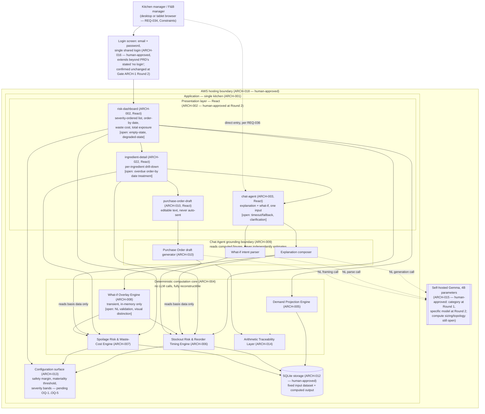

# Solution Architecture — Agentic Ingredient Demand Forecasting Assistant

**Workflow ID:** N/A (standalone PRD input — Shape B, no discovery-pipeline workflow record)
**Agent:** solution-architect-agent
**Created:** 2026-09-17
**Revised:** 2026-09-17 (Gate ARCH-1 REQUEST_CHANGES — Round 1); 2026-09-17 (Gate ARCH-1 REQUEST_CHANGES — Round 2, this revision)
**Status:** Approved
**Source artifact:** `docs/01-prd/prd-ingredient-demand-forecasting.md` — **Version 1.1, Status: Approved**, Last Updated 2026-09-17
**Source PRD provenance:** Synced from Confluence page "PRD - Agentic Ingredient Demand Forecasting Assistant" (id `5883461703`, space `~712020c78d0510dbf248218881c00989970857`), resolved via `confluence-doc-resolver` Mode `keyword_status` (keyword "PRD", required status Approved), invoked via `/generate-architecture`. The earlier v1.0 sibling page (id `5884510209`, `Status: Confirmed`) has since been deleted and is not a valid source for this architecture.
**Additional input — User Journeys:** Confluence page "Ingredient Demand Forecasting Assistant User Journeys" (id `5884608515`, space `~712020c78d0510dbf248218881c00989970857`), source of truth `docs/01b-user-journey/journeys.md` at v1.0 (Confirmed). That local file does not exist in this repo checkout; the Confluence page content, fetched directly via MCP for this revision, is the only available copy and is treated as authoritative for this run. Screen names used below (`risk-dashboard`, `ingredient-detail`, `chat-agent`, `purchase-order-draft`) are the journeys doc's own proposed working names — final naming is owned by the design stage (`docs/04-design`), not by this architecture.
**Human approval status:** APPROVED (Gate ARCH-1, Round 2 — approved 2026-09-17. Outstanding items — specific AWS compute service/topology, backend framework for the React API boundary, OQ-1–OQ-5, and the ARCH-016/PRD "no login" discrepancy — remain open and are not blockers to this approval; the discrepancy is deferred to a separate future `prd-agent` amendment run.)

## Revision note (Gate ARCH-1 — REQUEST_CHANGES, Round 1)

This is a revision of the prior draft (21 `ARCH-XXX` elements), which received **REQUEST_CHANGES** from the human reviewer at Gate ARCH-1. This revision:

1. **Incorporates the User Journeys page** (above) as grounding for screen names and interaction flows, and folds the journeys' explicitly named gaps/error flows (Chat Agent timeout/fallback, unparseable-input clarification, dashboard empty-state, dashboard degraded-state, overdue order-by date treatment, what-if visual distinction) into the affected components as open items or assumptions rather than dropping them silently.
2. **Applies four human decisions made at Gate ARCH-1**, now treated as resolved and no longer open:
   - Storage layer = **SQLite** (ARCH-012)
   - LLM/NL provider = **self-hosted, open-source model** (ARCH-015)
   - Deployment/hosting = **AWS** (ARCH-018)
   - AuthN/AuthZ = **basic email + password, single shared login** (ARCH-016)
3. **Leaves ARCH-002 (presentation/UI framework) open and unresolved** — no decision was given for it at Gate ARCH-1; it remains flagged as needing human approval for the next gate.
4. **Flags a new discrepancy** surfaced by decision (2)'s AuthN/AuthZ item: the PRD's Constraints and Non-Goals both state "single user, no login, no roles," but the human-approved architecture now requires login. This is recorded explicitly as a tension between the two documents — not silently reconciled — and is called out as a candidate for a PRD amendment. See ARCH-016.

All IDs from the prior draft are preserved; unchanged elements keep their original numbering. One new element (ARCH-022, Ingredient Detail screen) is added at the end of the numbered list to reflect a screen named explicitly in the journeys doc that had no dedicated element in the prior draft.

## Revision note (Gate ARCH-1 — REQUEST_CHANGES, Round 2 — this revision)

This is a second revision of this artifact, following a second **REQUEST_CHANGES** decision from the human reviewer at Gate ARCH-1 (Round 1, above, resolved SQLite, the self-hosted-OSS-LLM category, AWS, and email+password login). This revision applies exactly three new human decisions and otherwise leaves the Round 1 artifact unchanged:

1. **ARCH-002 (presentation/UI framework) is now APPROVED as React.** The prior "framework not decided, still open" status is resolved. React is now named explicitly as the frontend framework for `risk-dashboard` (ARCH-002), `ingredient-detail` (ARCH-022), `chat-agent` (ARCH-003), and `purchase-order-draft` (ARCH-010). This choice carries one direct, already-implied architectural consequence made explicit here rather than invented: a React frontend is client-rendered, not server-rendered, so the deterministic core (ARCH-004) and its SQLite-backed data (ARCH-012) must be exposed to the presentation layer across a defined backend API boundary, and the frontend now has a separate build/serve step from whatever serves that API. No state-management library, no specific backend framework or language, and no build-tooling choice is decided by this revision — those remain open and are not invented here.
2. **ARCH-015 (LLM/NL provider): the specific self-hosted model is now APPROVED as Gemma, 4B parameters.** The prior "self-hosted, open-source model, family unspecified" framing is resolved to a named model. Naming the model narrows — but does not itself decide — the still-open AWS compute/topology question carried forward from Round 1 (see ARCH-018 follow-on): a 4B-parameter model has real but modest GPU/CPU inference resource requirements, which rules out needing large multi-GPU or distributed-inference infrastructure, but the specific AWS instance type, managed inference service, or hosting topology remains an open, separate decision.
3. **ARCH-016 (AuthN/AuthZ: basic email + password, single shared login) is confirmed unchanged** from Round 1, exactly as previously resolved. The discrepancy this creates against the PRD's stated Constraint/Non-Goal ("single user, no login, no roles") remains explicitly flagged as **open, not resolved** — the human reviewer has acknowledged this discrepancy in this round and stated it will be addressed later via a separate PRD-amendment run (using `prd-agent`), not in this architecture revision. This is a deferral by explicit human choice, not a resolution; this document does not soften, downgrade, or remove the flagged discrepancy on that basis.

All other elements, the Round 1 resolutions (SQLite/ARCH-012, self-hosted-OSS-LLM category/ARCH-015, AWS/ARCH-018, login posture/ARCH-016), and all previously-carried-forward open items (specific AWS compute service/topology, whether the app and the model are one or two deployable units, OQ-1 through OQ-5, the missing numeric latency target for REQ-032/033, the Chat Agent timeout/fallback gap, the unparseable-input clarification gap, the dashboard empty-state and degraded-state gaps, the overdue-order-by-date treatment gap, and the what-if visual-distinction gap) are carried forward unchanged and are **not** re-litigated in this round.

## Notes on scope

This is a Shape B (standalone PRD) input. There is no `FEAT-XXX` layer for this product — every `ARCH-XXX` item below traces directly to one or more `REQ-XXX` ids from the Approved PRD, to the PRD's Constraints / Non-Goals / Open Questions sections, to the User Journeys page, or to an explicit Gate ARCH-1 human decision, where a requirement id alone doesn't capture the driver. No feature layer has been invented.

This architecture supersedes and replaces, in full, the prior drafts that lived at this path (the original pre-PRD-v1.1 draft, the 21-element Round 1 Gate-ARCH-1 draft, and now this Round 2 revision supersedes that Round 1 draft in turn). PRD v1.1 itself names no specific technology in its Constraints; the technology and hosting choices decided below (SQLite, self-hosted Gemma 4B, AWS, email+password login, React) are decided by explicit human instruction at Gate ARCH-1 across two REQUEST_CHANGES rounds, not inferred or inherited from the PRD or from any prior draft's assumptions. As of this Round 2 revision, no architectural element remains framed as a wholly undecided technology choice at the category level — what remains open is narrower, implementation-level follow-on decisions (see Open Items).

---

## Summary diagram

---

## Architecture elements

### ARCH-001 — Overall system shape: single-tenant, single-kitchen application
Traces to: Constraints ("Single user, no login, no roles"; "Platform: desktop or tablet browser only"), Non-Goals ("Multi-site operation — one kitchen only", "Accounts and permissions — single user, no login, no roles", "Mobile-specific interface — desktop or tablet browser is sufficient"), ARCH-016 (login, human-approved)
Description: The system serves exactly one kitchen, with no tenant/account model and no mobile-optimized surface. It is a browser-delivered application (desktop or tablet), not a native app. As of Gate ARCH-1, access to that single kitchen's data is gated by a single shared login (ARCH-016) rather than being open with no login at all — the system remains single-tenant and single-role, but is no longer login-free.
Rationale: The single-kitchen, single-role, non-mobile boundaries are stated directly and repeatedly in the PRD (Constraints and Non-Goals agree), so the architecture should not build any multi-tenant, multi-user, or native-mobile scaffolding that nothing in the PRD asks for. The login addition is a separate, explicit human decision (ARCH-016) layered on top of this boundary, not a change to the single-tenant shape itself.
Assumptions (flag if irreversible / needs human approval): Low risk as stated — this narrows scope rather than locking in technology. Flagging only that if this product is ever extended to a second kitchen or a second concurrent user, most components below (ARCH-011/ARCH-012 data model, ARCH-016 authN/authZ posture) would need revisiting; that is out of scope for v1 but should not be silently assumed away. See ARCH-016 for the discrepancy this login decision creates against the PRD's literal "no login" text.
Scalability/Availability/Observability notes: Scale target is fixed at one kitchen, one active session at a time — no concurrency or horizontal-scaling design is warranted for v1. Availability target is not stated by the PRD (see ARCH-019); do not assume an SLA.

### ARCH-002 — Risk Dashboard (`risk-dashboard`) — presentation layer (React, human-approved at Gate ARCH-1 Round 2)
Traces to: REQ-023, REQ-024, REQ-025, REQ-026, REQ-027, REQ-032, REQ-034, Constraints ("Platform: desktop or tablet browser only"), User Journeys (`journey-kitchen-manager-manage-stockout-risk`, `journey-kitchen-manager-manage-spoilage-risk`, `journey-fb-manager-review-aggregate-exposure`), human decision at Gate ARCH-1 Round 2 (React)
Description: A single dashboard view listing every at-risk ingredient ordered by severity (REQ-023), showing risk type — stockout or spoilage (REQ-024), order-by date for stockout-risk items (REQ-025), estimated waste cost for spoilage-risk items (REQ-026), and one aggregate total-waste-exposure figure (REQ-027). Severity is communicated by a text label in addition to colour so it stays legible under overhead kitchen light and on projected screens (REQ-034). This view must load and refresh materially faster than the Chat Agent's response budget (REQ-032). Per the User Journeys doc, the working screen name for this view is `risk-dashboard`; both kitchen-manager and F&B-manager journeys begin and end here. Drill-down into a single ingredient's detail is handled by a separate screen — see ARCH-022. **The presentation layer, including this dashboard, is built in React** — approved by the human reviewer at Gate ARCH-1 Round 2, resolving what was previously an open framework choice.
Rationale: Directly implements the dashboard requirement cluster; REQ-034 is called out in the PRD as a legibility/functional requirement, not a cosmetic one, so it is treated here as a hard rendering constraint (severity must be a discrete labeled value the UI renders, not color alone). The choice of React itself is a direct human decision at Gate ARCH-1 Round 2, not one this architecture derived independently.
Assumptions (flag if irreversible / needs human approval): **The presentation framework is now resolved: React**, approved by the human reviewer at Gate ARCH-1 Round 2 — no longer open for its own sake. One direct, already-implied consequence follows from this choice and is noted here rather than invented: React frontends are client-rendered, so this dashboard (and the other presentation-layer screens — ARCH-022, ARCH-003, ARCH-010) will call a defined backend API exposing the deterministic core's (ARCH-004) output and SQLite-backed data (ARCH-012), rather than being server-rendered directly against the core. This is a structural consequence of the React decision, not a new technology choice — the specific backend framework/language, any state-management library, and build tooling remain undecided and are not invented here. In addition, the User Journeys doc surfaces two gaps in this screen's behavior that this architecture does not resolve but must not drop: (a) **no defined empty-state** for the case where the kitchen is fully healthy and there are zero at-risk ingredients — the journeys doc notes the aggregate figure and the list both have undefined behavior in that case (affects REQ-023, REQ-027); (b) **no defined degraded/stale-data state** if this screen misses its REQ-032 load-time target — it's unspecified whether a slow load shows stale cached data, a loading indicator, or an error. Both are product/UX decisions needed before this screen can be considered fully specified, not architecture-level gaps this document can close on its own.
Scalability/Availability/Observability notes: Data volume is small (15–20 dishes, 30–40 ingredients per Input Data), so rendering performance is not a scaling concern; REQ-032's "materially faster than chat" requirement is a UX/latency-budget constraint, not a scale constraint — satisfied by keeping the dashboard's data path entirely within the deterministic core (ARCH-004) reading from SQLite (ARCH-012), never behind an LLM call, and reached from React only via the backend API boundary noted above. The degraded-state gap noted above interacts with ARCH-012's SQLite read path and ARCH-019's latency budget once a decision is made.

### ARCH-003 — Chat Agent (`chat-agent`): single conversational surface for explanation and what-if
Traces to: REQ-013, REQ-017, REQ-036, REQ-033, User Journeys (`journey-kitchen-manager-manage-stockout-risk`, `journey-kitchen-manager-manage-spoilage-risk`, `journey-kitchen-manager-test-menu-change`, cross-cutting Gaps)
Description: One conversational input surface serves two capabilities — interrogating any dashboard warning in natural language (REQ-013) and posing a hypothetical demand change in natural language (REQ-017) — per REQ-036's explicit requirement that both be accessible through the same Chat Agent interface rather than two disconnected inputs. Every response is returned within a few seconds (REQ-033). Per the journeys doc, the working screen name is `chat-agent`; it is reached both from `ingredient-detail` (asking "why flagged") and directly from `risk-dashboard` (posing a what-if, per `journey-kitchen-manager-test-menu-change`), consistent with REQ-036's single-surface requirement. Like the rest of the presentation layer, this surface is built in React (ARCH-002).
Rationale: REQ-036 is unambiguous that this must be one surface, not two; keeping explanation and what-if intent recognition behind a shared entry point (with routing to the appropriate downstream component, ARCH-009/ARCH-008) is the direct implementation of that requirement.
Assumptions (flag if irreversible / needs human approval): The mechanism for distinguishing an "explain this warning" question from a "what-if" question within one free-text input (intent classification) remains an implementation detail left open by the PRD. Two additional gaps are named explicitly and repeatedly in the User Journeys doc (as a cross-cutting gap affecting all three kitchen-manager journeys) and must be carried forward as open items rather than assumed away: (a) **no defined timeout/fallback behavior** if the Chat Agent does not return within REQ-033's "a few seconds" — no retry, timeout, or partial-answer behavior is specified anywhere; (b) **no defined clarification/validation behavior** for an unparseable, ambiguous, or out-of-scope question (e.g., referencing a dish not on the menu, an out-of-range date, or a question the system cannot map to any warning). Both are product/UX decisions, not purely technical ones, and both should be resolved before REQ-033 and REQ-013/017 can be considered fully specified for acceptance testing. See also ARCH-008 (what-if-specific instance of gap (b)) and ARCH-009 (grounding boundary implications) and ARCH-019 (latency budget).
Scalability/Availability/Observability notes: Volume is bounded by a single kitchen manager's usage pattern (a few sessions per week per Target Users); no concurrency design needed. See ARCH-019 for the REQ-033 latency budget and ARCH-020 for logging.

### ARCH-004 — Deterministic computation core (no LLM calls, fully reconstructible)
Traces to: REQ-028, REQ-029, REQ-030, REQ-031
Description: A module boundary — projection, stockout risk, spoilage risk, reorder timing, and their supporting arithmetic — that runs with zero dependency on any language-model call and produces identical output on every run given the same input data (REQ-028). Every figure this core produces (stockout date, order-by date, order quantity, waste cost, aggregate exposure) must be reconstructible as an explicit arithmetic trace back to the underlying input data (REQ-029). Nothing outside this boundary — including the Chat Agent — computes or independently estimates a quantity that isn't already produced and shown by this core (REQ-030); anything the Chat Agent narrates must be numerically identical to what this core produced for the same warning (REQ-031). This core reads its input data from, and writes its computed output to, the SQLite storage layer (ARCH-012).
Rationale: REQ-028 through REQ-031 together define a hard non-negotiable boundary: computation happens once, deterministically, in one place, and every other component (dashboard, chat, PO draft) only ever reads and narrates that computation's output. Structuring the system around this boundary is what makes REQ-031's cross-surface numerical consistency achievable rather than an emergent hope.
Assumptions (flag if irreversible / needs human approval): The determinism guarantee (REQ-028) implies no hidden non-determinism sources (system clock reads without pinning, unseeded randomness, floating-point order-of-operation drift). This should be enforced with a repeatability test (rerun the pipeline twice against unchanged input data and diff the output) before acceptance — an implementation/test-strategy concern, not a technology lock-in. SQLite's single-writer model (ARCH-012) is naturally compatible with this determinism requirement at the stated single-session usage volume — noted as a coherence check on the Gate ARCH-1 storage decision, not a new risk it introduces.
Scalability/Availability/Observability notes: Input data volume is small (12 weeks of daily sales across 15–20 dishes, 30–40 ingredients); compute cost is negligible regardless of implementation technology. Observability: see ARCH-020 — every computation run's inputs/outputs should be logged so REQ-029's "reconstructible arithmetic trace" is something a reviewer can actually inspect, not just a design intention.

### ARCH-005 — Ingredient demand projection engine
Traces to: REQ-001, REQ-002, REQ-003, REQ-004
Description: Projects demand for every ingredient over a forward horizon of at least 14 days (REQ-001), reflecting day-of-week patterns rather than a flat daily average (REQ-002) and weighting recent trend movement more heavily than older history (REQ-003). Ingredient-level projections are derived by mapping each dish's projected demand through its recipe and summing across every dish containing that ingredient (REQ-004) — i.e., this engine consumes dish-level projections and the recipe/BOM mapping (ARCH-011) as inputs.
Rationale: Directly implements the demand-projection requirement cluster in the order the PRD states it: dish-level pattern-aware projection first, then roll-up through the recipe to ingredient level.
Assumptions (flag if irreversible / needs human approval): The specific statistical method for day-of-week pattern recognition and recency weighting (e.g., weighted moving average vs. a formal time-series model) is not specified by the PRD beyond the two stated properties (REQ-002, REQ-003) and the Constraint that the projection need only be "directionally useful, not precise to the gram." This is a modeling choice, not an irreversible technology lock-in, but should be reviewed against the 12-week/15–20-dish data volume (Input Data) to confirm the chosen method is meaningfully calibratable on that little history.
Scalability/Availability/Observability notes: Not a scaling concern at this data volume. Observability: intermediate values (per-weekday baseline, trend factor, rolled-up ingredient total) should be retained and exposed to the Chat Agent's explanation composer (ARCH-009) so REQ-014's "relative contribution per dish" and REQ-015's "relevant dates" have real numbers to cite rather than a paraphrase.

### ARCH-006 — Stockout risk & reorder timing engine
Traces to: REQ-005, REQ-006, REQ-007, REQ-008, REQ-009, User Journeys (`journey-kitchen-manager-manage-stockout-risk`)
Description: For each ingredient, determines whether projected consumption will exhaust current stock within the forward horizon (REQ-005); if so, computes the projected stockout date (REQ-006); computes an order-by date earlier than that stockout date by the ingredient's supplier lead time plus a safety margin (REQ-007); computes a suggested order quantity covering projected consumption across the lead-time gap (REQ-008); and assigns a severity driven by how soon the order-by date falls (REQ-009).
Rationale: Directly implements the full stockout-risk requirement cluster as one cohesive engine, since REQ-006 through REQ-009 are a sequential derivation from REQ-005's flag (stockout date → order-by date → order quantity → severity), each depending on the previous.
Assumptions (flag if irreversible / needs human approval): REQ-007's "safety margin" and REQ-009's severity thresholds are explicitly undefined by the client — see **OQ-1** (safety margin value/configurability, owner: client) and **OQ-4** (severity bands and day-based thresholds, owner: client). This engine cannot be finalized without those answers; it is architected to read both as configuration (ARCH-013) rather than hardcoded constants, precisely because they are open. The User Journeys doc corroborates OQ-4 with a concrete unresolved case: **a stockout ingredient whose order-by date has already passed by the time the manager views it has no distinct treatment defined from ordinary severity** — this is folded into OQ-4 rather than treated as a new, separate open question, but is now named as a specific scenario that must be covered once OQ-4 is answered (affects this engine, ARCH-002's severity rendering, and ARCH-022's detail view). **This remains a functional-completeness gap requiring client input, not an architecture decision this document can resolve.**
Scalability/Availability/Observability notes: Not a scaling concern at this data volume (30–40 ingredients). Observability: retain the computed basis (stockout date, lead time, safety margin applied, order quantity derivation) per ingredient so the Chat Agent's explanation (ARCH-009) can state the exact supplier lead time driving the order-by date, per REQ-016.

### ARCH-007 — Spoilage risk & waste-cost engine
Traces to: REQ-010, REQ-011, REQ-012, User Journeys (`journey-kitchen-manager-manage-spoilage-risk`)
Description: For each perishable ingredient, determines whether stock on hand is unlikely to be consumed before its use-by date given projected consumption (REQ-010); for each ingredient so flagged, computes an estimated waste cost in INR as unconsumed quantity valued at unit cost (REQ-011); suppresses from view any spoilage warning whose estimated waste cost falls below a configurable materiality threshold (REQ-012).
Rationale: Directly implements the spoilage-risk requirement cluster; kept as a separate engine from stockout risk (ARCH-006) because the two flag types have independent triggering logic (use-by date vs. supplier lead time) even though both feed the same dashboard and Chat Agent.
Assumptions (flag if irreversible / needs human approval): REQ-012's materiality threshold has no default value, unit, or owner stated — see **OQ-2** (default value/unit and who sets it, owner: client) and **OQ-3** (whether the "total waste exposure" aggregate on the dashboard, REQ-027, includes suppressed warnings or only displayed ones, owner: client). OQ-3 in particular changes what REQ-027's aggregate figure *means*, and this engine's output feeds that aggregate directly — **flagging as a functional-completeness gap requiring client input before REQ-027's dashboard figure can be considered correct, not merely cosmetic.** The User Journeys doc corroborates both OQ-2 and OQ-3 as live gaps affecting this journey without introducing new ones.
Scalability/Availability/Observability notes: Not a scaling concern. Observability: retain per-ingredient the projected unconsumed quantity, unit cost, and use-by date so the explanation composer (ARCH-009) can cite the rupee estimate and the use-by date driving it, per Success Metrics step 2.

### ARCH-008 — What-if scenario overlay engine (transient, in-memory only)
Traces to: REQ-017, REQ-018, REQ-019, REQ-020, Non-Goals ("Scenario persistence — what-if results are transient; no saving, naming or comparing of scenarios"), User Journeys (`journey-kitchen-manager-test-menu-change`)
Description: Accepts a structured hypothetical demand change (dish, added/altered serving count, date or date range) — produced by parsing the manager's natural-language what-if statement (ARCH-009) — and recomputes, against an overlay layered on top of (not written into) the underlying data: which ingredients newly become at-risk (REQ-018), which order-by dates move (REQ-019), and how total waste exposure changes (REQ-020). The overlay and its results exist only for the current interaction; nothing is saved, named, or made comparable across sessions, per the explicit Non-Goal. Per the journeys doc, the resulting scenario-adjusted view is reflected back on `risk-dashboard` transiently.
Rationale: Directly implements the what-if requirement cluster while honoring the "no scenario persistence" Non-Goal; reusing the stockout (ARCH-006) and spoilage (ARCH-007) engines against overlaid input avoids building a second, divergent risk-computation path for the what-if case.
Assumptions (flag if irreversible / needs human approval): The Non-Goal's "transient, no saving" behavior means a manager who explores several what-if scenarios has no way to recover or compare them after the fact, and no record survives a page reload or session end. This is directly specified by the PRD (not an architecture invention), but is flagged here so the human sponsor is explicitly confirming — not merely inheriting — that this is acceptable product behavior for v1. Two additional gaps are named explicitly by the User Journeys doc and must be carried forward rather than assumed away: (a) **no defined validation or clarifying-question behavior** for ambiguous phrasing, a dish not on the menu, or an out-of-range date in a what-if statement (this is the what-if-specific instance of the same class of gap flagged for ARCH-003/ARCH-009 generally); (b) **how the "scenario-adjusted view" is visually distinguished from real data on `risk-dashboard` is explicitly left to the design stage, not specified as a requirement** — the journeys doc flags this precisely so the dashboard isn't assumed to silently and permanently change when a what-if is active. This architecture's obligation, given (b), is a data-contract one: this engine's output must be clearly tagged as scenario-derived (not persisted, not identical to the underlying real data) in whatever it hands back to the presentation layer, so that now that ARCH-002's framework is resolved (React), the UI has the hook it needs to render the distinction — the visual treatment itself remains a design-stage decision, not decided here.
Scalability/Availability/Observability notes: Single overlay at a time is sufficient — the PRD gives no indication multiple concurrent what-if scenarios need to be layered simultaneously. Observability: log each what-if request's parsed parameters and resulting deltas (ARCH-020), since the overlay itself leaves no other trace — this is the only way to reconstruct what happened during a demo or review session after the fact.

### ARCH-009 — Chat Agent grounding boundary: reads computed figures, never independently estimates
Traces to: REQ-013, REQ-014, REQ-015, REQ-016, REQ-030, REQ-031, REQ-036
Description: An architectural rule enforced at every point the Chat Agent generates natural language: it may only narrate figures already produced by the deterministic core (ARCH-004/005/006/007) — naming the contributing dishes and each one's relative contribution (REQ-014), stating the relevant dates driving the flag (REQ-015), and for stockout flags, stating the supplier lead time that set the order-by date (REQ-016) — and must never independently compute or estimate a quantity not already shown elsewhere (REQ-030). This is what makes an explanation numerically consistent with the dashboard figures for that same warning (REQ-031), which is the specific bar Success Metrics step 3 and 5 hold this product to.
Rationale: REQ-030 and REQ-031 are the two requirements that most directly distinguish this product from "an LLM summarizing a spreadsheet" — the PRD is explicit that a vague or inconsistent answer at the explanation or what-if step fails acceptance regardless of dashboard quality. Making this a named, testable boundary (not an implicit hope) is the point of this element.
Assumptions (flag if irreversible / needs human approval): Enforcing this boundary in practice depends on the explanation-generation call being given the deterministic core's basis data as explicit input context (not asked to "figure it out"), and on validating that the language model's restatement of a number is byte-for-byte or rounding-consistent with the source figure. This validation approach is a test-strategy concern (recommend an automated check that diffs any number appearing in a generated explanation against the dashboard's stored value for that same warning) rather than an irreversible architecture decision. This grounding boundary also inherits ARCH-003's two open gaps (no defined timeout/fallback, no defined clarification for unparseable input) — a timeout or an unparseable question both represent cases where this boundary's "narrate only computed figures" rule needs a defined behavior for producing *no* figure at all, which is not yet specified.
Scalability/Availability/Observability notes: See ARCH-015 (LLM provider) and ARCH-020 (logging). No scale concern at stated usage volumes.

### ARCH-010 — Purchase order draft generator (`purchase-order-draft`)
Traces to: REQ-021, REQ-022, Non-Goals ("Procurement integration — no connection to any supplier portal, EDI channel or ordering system. Orders are drafted as text only.")
Description: For any ingredient flagged at stockout risk, produces a purchase-order draft containing the supplier's name, the item, the suggested quantity, and the required delivery date (REQ-021) — all values sourced from the stockout engine (ARCH-006), with natural-language framing only. The draft is presented as editable text for the manager to review and modify before sending through their own channel; it is never sent automatically (REQ-022). Per the User Journeys doc, this is reached from `ingredient-detail` and its working screen name is `purchase-order-draft`; this screen, like the rest of the presentation layer, is built in React (ARCH-002).
Rationale: Directly implements the PO-drafting requirement within the explicit "text only, no integration" Non-Goal boundary — there is no supplier API, EDI channel, or send capability anywhere in this design.
Assumptions (flag if irreversible / needs human approval): None beyond ARCH-015's general LLM-provider notes (this component makes an NL-generation call). Explicitly noting for completeness: no email-send, no procurement-system API call, and no PO persistence exist or are implied — text output only, matching the Non-Goal precisely.
Scalability/Availability/Observability notes: See ARCH-015 and ARCH-020. Not a scaling concern.

### ARCH-011 — Fixed input dataset ingestion & data model
Traces to: Input Data (sales history, menu, recipes, ingredients, current stock, suppliers), Constraints ("Data is supplied, not sourced"; unit consistency guaranteed by the client), Non-Goals ("Ongoing data entry", "Unit conversion"), ARCH-012 (SQLite, human-approved)
Description: A data model covering the six supplied inputs — daily sales history per dish (12 weeks), menu (15–20 dishes), recipes (ingredient quantities per serving, 30–40 distinct ingredients), ingredients (unit, unit cost, perishable flag, shelf life), current stock (quantity on hand, use-by date per ingredient), and suppliers (3–5, each with a lead time, one supplier per ingredient) — loaded once from the fixed, supplied dataset. With ARCH-012 now resolved (SQLite), this data model has a concrete target: a SQLite schema holding these six inputs plus the deterministic core's computed output. No screens exist for logging sales, receiving deliveries, or recording stock counts (explicit Non-Goal), and no unit-conversion logic exists anywhere in the model, since unit consistency across recipe quantities and supplier pricing is guaranteed by the client, not derived (explicit Non-Goal).
Rationale: Mirrors the Input Data section's itemized breakdown exactly; the absence of a data-entry UI and a conversion layer are both explicit non-goals, not architecture-invented gaps, so this element documents that absence rather than silently filling it.
Assumptions (flag if irreversible / needs human approval): If the "unit consistency guaranteed by the client" assumption is ever wrong for real data (as opposed to the fixed dataset used for this build), figures computed downstream (REQ-008 suggested order quantity, REQ-011 waste cost) would be silently wrong with no validation layer to catch it, since no conversion/validation logic is in scope. Flagging this as a data-quality risk inherited directly from the Constraint, not something this architecture can mitigate without contradicting the stated Non-Goal — worth a light input-validation check (e.g., a SQLite-level check constraint confirming declared units match across recipe and supplier records) even though full conversion remains explicitly out of scope.
Scalability/Availability/Observability notes: Data volume is small and fixed for the life of this build (a few thousand rows at most) — comfortably within SQLite's envelope. No ongoing ingestion pipeline is needed since there is no ongoing data entry.

### ARCH-012 — Storage layer: SQLite (human-approved at Gate ARCH-1)
Traces to: REQ-028 (determinism depends on stable, unmutated input data across runs), REQ-032, REQ-033, Constraints ("Data is supplied, not sourced"), human decision at Gate ARCH-1
Description: **SQLite is the approved storage technology**, holding the fixed input dataset (ARCH-011), the deterministic core's computed output (ARCH-004), the arithmetic trace (ARCH-014), and the configuration surface (ARCH-013) for the dashboard, ingredient-detail screen, and Chat Agent to read from. This was flagged as "technology not decided" in the prior draft; it is now resolved by explicit human approval at Gate ARCH-1 and is no longer open.
Rationale: SQLite is a single-file, embedded, serverless database engine well matched to this system's small, fixed data volume (a few thousand rows), single-active-session usage pattern (ARCH-001), and read-heavy access pattern from the dashboard/chat/PO-draft paths — a fit the human reviewer confirmed at Gate ARCH-1 rather than one this architecture invents post hoc.
Assumptions (flag if irreversible / needs human approval): This is now a decided, human-approved choice — no longer open for its own sake. Noting downstream consequences that follow from it, rather than new decisions being made here: (a) SQLite's single-writer model is consistent with ARCH-001's single-kitchen/single-session scope and poses no concurrency risk at this usage volume; (b) under AWS hosting (ARCH-018), SQLite implies the application needs a compute environment with an attached, persistent, durable disk, rather than a stateless/ephemeral-compute or fully managed relational-database service — this is a direct, unavoidable consequence of the SQLite decision, not a new AWS service being chosen on this document's own authority (see ARCH-018); (c) SQLite provides no built-in backup/replication — if durability beyond a single disk matters, that needs a separate, still-open decision (e.g., periodic snapshot/export of the SQLite file) that this document does not resolve.
Scalability/Availability/Observability notes: Data volume is small regardless (Input Data bounds it at 15–20 dishes, 30–40 ingredients, 3–5 suppliers, 12 weeks of history) — SQLite comfortably covers this. No durability/backup requirement is stated by the PRD; per (c) above, if the underlying disk is lost, the dataset would need to be re-supplied and computed output rebuilt, since the system does not source or infer it independently.

### ARCH-013 — Configuration surface for undefined thresholds
Traces to: REQ-007, REQ-009, REQ-012, REQ-019, REQ-021, REQ-023, REQ-025, REQ-026, REQ-034; OQ-1, OQ-2, OQ-3, OQ-4, OQ-5
Description: A single, explicit configuration surface (not hardcoded constants scattered through the codebase), persisted in the SQLite storage layer (ARCH-012), holding every value the PRD's Open Questions leave unresolved: the safety margin added to supplier lead time (OQ-1, blocks REQ-007/009/019/021/025), the materiality threshold and its unit (OQ-2, blocks REQ-012), whether total waste exposure includes suppressed warnings (OQ-3, blocks REQ-027), and the severity bands/thresholds for both stockout and spoilage risk and how the two risk types rank against each other on one combined list (OQ-4/OQ-5, blocks REQ-009/023/026/034 — and, per the User Journeys doc, also determines whether an overdue order-by date gets a distinct severity treatment, see ARCH-006).
Rationale: Five of the PRD's requirements are explicitly blocked on client answers the PRD itself flags as missing. Architecting these as named, swappable configuration rather than guessed-and-hardcoded values means the eventual client answers can be dropped in without re-deriving the engines that consume them (ARCH-006, ARCH-007).
Assumptions (flag if irreversible / needs human approval): **This is not a technology decision but a functional-completeness gap that blocks correct behavior of REQ-007, REQ-009, REQ-012, REQ-019, REQ-021, REQ-023, REQ-025, REQ-026, and REQ-034 until the client answers OQ-1 through OQ-5.** No default value should be silently invented and shipped as if it were the client's answer — per this repo's hard rule against converting an assumption into a requirement, any placeholder value used for interim development must be visibly labeled as a placeholder, not presented as a decided threshold.
Scalability/Availability/Observability notes: Not a scaling concern. Observability: changes to any configured value should be logged (ARCH-020), since a materiality-threshold or safety-margin change would retroactively change which warnings appear — a reviewer comparing two sessions needs to know if the config, not just the data, changed.

### ARCH-014 — Arithmetic traceability / audit-trail layer
Traces to: REQ-029, REQ-031
Description: Every figure surfaced to the manager — stockout date, order-by date, order quantity, waste cost, aggregate exposure — retains, alongside its final value, the explicit arithmetic chain that produced it (baseline demand, trend factor, recipe roll-up, lead time, safety margin, unit cost, etc.), so that figure is reconstructible on demand rather than only ever shown as a bare number. This trace is persisted in SQLite (ARCH-012) alongside the input data and computed output.
Rationale: REQ-029 requires this explicitly and by name; it is also the mechanism that makes REQ-031's cross-surface consistency checkable rather than aspirational — the explanation composer (ARCH-009) and the dashboard (ARCH-002) should be reading the same stored trace for the same warning, not two independently-computed paths that happen to usually agree.
Assumptions (flag if irreversible / needs human approval): None as a technology choice — this is a design discipline (retain intermediate values, don't discard them after computing the final number), now concretely backed by ARCH-012's SQLite decision. Flagging only that it must be designed in from the start, since retrofitting traceability onto a "final numbers only" computation core after the fact is materially harder than building it in from ARCH-004 onward.
Scalability/Availability/Observability notes: Marginal storage/compute cost of retaining intermediate values is negligible at this data volume, and SQLite comfortably accommodates it.

### ARCH-015 — LLM / natural-language provider: self-hosted Gemma, 4B parameters (category human-approved at Gate ARCH-1 Round 1; specific model human-approved at Round 2)
Traces to: REQ-013, REQ-017, REQ-033, REQ-036, REQ-021/022, human decision at Gate ARCH-1 Round 1 (category), human decision at Gate ARCH-1 Round 2, this revision (specific model)
Description: **The organization will host Gemma, a 4-billion-parameter open-source language model,** for all natural-language understanding and generation needs — explanation composition (REQ-013), what-if parsing (REQ-017), and PO-draft NL framing (REQ-021/022) — rather than calling a third-party hosted/cloud LLM API. Round 1 of Gate ARCH-1 resolved the *category* of provider (self-hosted, open-source, vs. third-party API); this Round 2 revision resolves the *specific model* within that category — **Gemma, 4B parameters** — by explicit human instruction. Neither decision is inferred or inherited from the PRD.
Rationale: A natural-language capability remains functionally required by the Chat Agent (ARCH-003/009) and PO-draft generator (ARCH-010); the human reviewer resolved the vendor/hosting-category question in favor of self-hosting at Round 1, directly addressing the data-confidentiality concern the original draft raised about supplier cost data leaving the application boundary. Naming the specific model at Round 2 removes the remaining ambiguity about what infrastructure needs to be sized and procured; the human reviewer's choice of a 4B-parameter model is a deliberate middle ground between capability and self-hosting cost/complexity, consistent with the low usage volume stated in Target Users.
Assumptions (flag if irreversible / needs human approval): The category decision (self-hosted, open-source) and the specific model (Gemma, 4B parameters) are both now resolved and no longer open. **Still open and requiring follow-through:** the compute sizing needed to host Gemma 4B (e.g., GPU vs. CPU-only inference, memory footprint) is a direct consequence of this decision and of ARCH-018 (AWS), but is not itself decided here. Naming the specific model does narrow this follow-on question in a concrete way worth recording: a 4B-parameter model has real but modest inference resource requirements — it is inference-feasible on a single modest GPU or, with acceptable latency trade-offs, on CPU-only compute — which rules out needing large multi-GPU or distributed-inference infrastructure, but does **not** itself select a specific AWS instance type, managed inference service, or hosting topology; that remains a separate, still-open implementation decision (see ARCH-018, ARCH-017). Re-examining the data-confidentiality concern raised in the prior drafts (supplier cost data appearing in prompts, e.g., for PO drafts or explanations citing unit costs): naming Gemma specifically does not change this analysis from Round 1 — self-hosting (now self-hosting Gemma specifically) keeps this data within infrastructure the organization controls (per ARCH-018, AWS under the org's own account), which meaningfully reduces confidentiality exposure relative to a third-party API. It does not eliminate the concern entirely: the data still crosses from the application process to a separate inference service/compute instance, and standard controls (network segmentation between the app and the model-hosting instance, access logging, at-rest encryption of any logged prompts/responses) remain a Risk & Compliance / security review item, not something this architecture asserts is handled by virtue of self-hosting alone.
Scalability/Availability/Observability notes: Usage volume is low per Target Users (a few sessions per week); self-hosting Gemma 4B means no external rate-limit or third-party outage dependency, but does introduce a new operational responsibility (the org must keep the model-hosting instance available, patched, and provisioned with adequate — but, per above, modest — compute for a 4B-parameter model) that a third-party API would have absorbed — noted as a trade-off of this decision, not a defect in it. Observability: log request type (explanation/what-if/PO-draft), latency, and any inference-service error locally (ARCH-020); the data-in-logs caution from Round 1 still applies.

### ARCH-016 — AuthN/AuthZ posture: basic email + password, single shared login (human-approved at Gate ARCH-1 Round 1; confirmed unchanged at Round 2 — extends beyond PRD v1.1 scope)
Traces to: human decision at Gate ARCH-1 Round 1 (confirmed unchanged at Round 2); PRD Constraints ("Single user, no login, no roles"), Non-Goals ("Accounts and permissions — single user, no login, no roles") — **now superseded for architecture purposes by explicit human instruction, not silently reconciled**
Description: The application requires a basic email + password login before use. Consistent with the human reviewer's instruction at Gate ARCH-1 and with the PRD's own "single user" framing, this is scoped as **one single shared login** (one set of credentials for the kitchen), not a multi-account or role-based system — no per-user data isolation, no role model. This scoping is a working assumption carried forward from the PRD's single-user framing to fill in a detail the human instruction didn't spell out, not additional invention beyond what was specified; it should be revisited explicitly if the human says otherwise.
Rationale: This is a direct, explicit human decision made at Gate ARCH-1 Round 1 REQUEST_CHANGES, not one this architecture derived independently from the PRD. At Round 2, the human reviewer confirmed this decision unchanged.
Assumptions (flag if irreversible / needs human approval): **Flagging a plain discrepancy, not resolving it:** PRD v1.1 (Approved) states, as both a Constraint and a Non-Goal, "single user, no login, no roles." The architecture, per this explicit Gate ARCH-1 human instruction, now requires login. These two statements are in direct tension. This document does not silently reconcile them in either direction — it records that the architecture-level decision (login required) currently supersedes the PRD's literal text for this component, and flags this as a candidate for a **PRD amendment** (updating the PRD's Constraints/Non-Goals to reflect that login is in scope) so the two documents don't drift silently out of sync. **At Gate ARCH-1 Round 2, the human reviewer confirmed this decision unchanged and explicitly stated that the PRD-side discrepancy will be addressed later via a separate PRD-amendment run (using `prd-agent`), not in this architecture revision.** This is a deferral of the fix, not a resolution of the discrepancy itself — this document continues to flag the discrepancy as open rather than treating the human's acknowledgment of it as closing it. Until that future amendment happens, a reviewer comparing the PRD and this architecture should expect to see this exact discrepancy, not treat it as an error in either document. Separately, still flagging for Risk & Compliance / security review (unchanged in substance from Round 1): password storage/hashing approach, session management, and password-reset flow are not specified by the Gate ARCH-1 instruction and are not decided here — "basic email + password" names a posture, not a full security design.
Scalability/Availability/Observability notes: Single shared credential set — no per-user session isolation or audit-by-user distinction is implied; if a future PRD amendment (above) introduces multi-user needs, this would need revisiting alongside ARCH-011/012's data model. Observability: login attempts (success/failure) should be logged (ARCH-020) at a basic level even for a single shared account, since this is now a security-relevant surface that did not exist in the original draft.

### ARCH-017 — External integration boundary: none (LLM capability is now self-hosted, not a third-party integration)
Traces to: Non-Goals ("Procurement integration", "Live POS integration"), REQ-022 (PO draft sent "through their own channel," implying no system-to-system send), ARCH-015 (self-hosted, human-approved)
Description: The application has no integration with any supplier portal, EDI channel, ordering system, or POS/till system (Toast, Square, etc.) — sales history is a fixed, supplied dataset, and orders are drafted as text only, sent manually by the manager. With ARCH-015's Gate ARCH-1 resolution (self-hosted, open-source LLM — Gemma, 4B parameters, per Round 2), the natural-language capability is also no longer a third-party external dependency: it is a call from the application to a model-hosting component the organization runs itself, both presumably within the same AWS account per ARCH-018. **The system therefore has zero external, third-party network dependencies in this revised architecture** — a change from the original draft, where the LLM call was flagged as a conditional external dependency.
Rationale: Directly matches both explicit Non-Goals; ARCH-015's Gate ARCH-1 resolution removes what was previously the one conditional external dependency in the original draft.
Assumptions (flag if irreversible / needs human approval): Whether the application and the self-hosted model (Gemma 4B) run as one deployable unit or two separate services within AWS (and, if two, over what network boundary they communicate) is not decided by ARCH-015 or ARCH-018 alone — flagging as an implementation-level follow-on decision. It does not require the same tier of sign-off as ARCH-012/015/016/018 (it's a topology detail downstream of those, not a new irreversible technology/vendor choice), but is named here so it isn't silently assumed.
Scalability/Availability/Observability notes: No third-party integration surface to monitor; internal app-to-model-hosting calls should still be logged per ARCH-020 for latency/error visibility (ARCH-019).

### ARCH-018 — Deployment / hosting model: AWS (human-approved at Gate ARCH-1)
Traces to: Constraints ("Fixed-deadline build... scope as written is a ceiling, not a starting point"; "Platform: desktop or tablet browser only"), Success Metrics ("A reviewer, working only from the interface, can complete the following sequence unaided"), human decision at Gate ARCH-1
Description: **AWS is the approved hosting platform** for this application. This resolves the prior draft's open "local machine vs. hosted instance" question in favor of a hosted deployment reachable over the network — consistent with ARCH-016's now-required login (a hosted, network-reachable instance is the scenario in which a login requirement is most clearly warranted, whereas a single local machine used by one person alone would make login less obviously necessary; the two Gate ARCH-1 decisions are mutually reinforcing, not independent).
Rationale: Directly resolves what was flagged in the original draft as the single most upstream open decision — storage, provider hosting, and authN posture all depend on where the application runs.
Assumptions (flag if irreversible / needs human approval): This is now decided at the platform level (AWS) and no longer open. Deliberately **not over-specifying beyond what's approved**: no specific AWS service (e.g., EC2 vs. ECS/Fargate vs. Lambda, RDS vs. self-managed) is named here, since none was directly instructed and none is unambiguously implied — except two direct consequences worth noting, not inventing: (1) ARCH-012's approved choice of SQLite (a single-file, embedded database) is not compatible with a stateless/ephemeral-compute or fully-managed-relational-database service; it needs a compute environment with an attached, persistent, durable disk (e.g., a long-lived instance rather than an auto-scaled, disk-less container fleet); (2) ARCH-015's Round 2 resolution (self-hosted Gemma, 4B parameters) has a modest but real GPU/CPU inference footprint, which rules out needing large-scale multi-GPU infrastructure and further narrows the field of appropriate AWS compute options. Both are flagged as **constraints that fall out of already-approved decisions**, not new AWS services being chosen on this document's own authority — the specific AWS compute service/topology that satisfies both remains a separate, still-open implementation decision for whoever builds this.
Scalability/Availability/Observability notes: No uptime/availability target is stated by the PRD; a single hosted instance with no redundancy is consistent with the stated usage volume (a single kitchen, a few sessions per week) unless the human approver wants an explicit SLA — not assumed here. AWS hosting makes centralized logging (e.g., CloudWatch or an equivalent) newly feasible where the original "local-only" framing would not have supported it — noted as an opportunity for ARCH-020, not a new requirement.

### ARCH-019 — Performance tiering: dashboard fast path vs. conversational latency budget
Traces to: REQ-032, REQ-033
Description: Two distinct latency budgets exist in this system: the risk dashboard must load and its figures be available materially faster than the natural-language response time (REQ-032) — i.e., fast enough to check in passing — while a natural-language question (explanation or what-if) is allowed a response window of a few seconds (REQ-033). Architecturally, this means the dashboard's data path must never sit behind an LLM call (consistent with ARCH-004's boundary), while the Chat Agent path may legitimately incur provider latency.
Rationale: Directly implements the two stated performance NFRs by construction — separating the fast, deterministic path (dashboard) from the slower, LLM-involving path (chat) is what makes both budgets simultaneously achievable rather than in tension.
Assumptions (flag if irreversible / needs human approval): Neither REQ-032 nor REQ-033 states a numeric target (no millisecond or second count is given beyond "materially faster" and "a few seconds") — this is a qualitative bar, not a measurable SLA. Flagging for the human reviewer to confirm whether a numeric target should be agreed with the client before test-strategy acceptance criteria are written. This is also the budget within which ARCH-003's undefined Chat Agent timeout/fallback gap sits — "a few seconds" cannot be tested as a pass/fail bound until both a numeric target and a defined behavior for missing it exist.
Scalability/Availability/Observability notes: See ARCH-015 for the self-hosting-dependent portion of chat latency; see ARCH-020 for logging response times to verify both budgets are actually met in practice, not just in design intent.

### ARCH-020 — Observability approach: computation and Chat Agent invocation logging
Traces to: REQ-028 (determinism verification), REQ-029 (arithmetic traceability), REQ-031 (cross-surface consistency), REQ-033 (response-time verification)
Description: Every deterministic-core computation run, every Chat Agent invocation (explanation, what-if parse, PO draft), every login attempt (ARCH-016), and every configuration value in effect at the time (ARCH-013) is logged, with enough detail to reconstruct why a given figure or answer had the value it did. AWS hosting (ARCH-018) makes centralized logging newly practical for this; SQLite (ARCH-012) can also hold structured logs if a separate logging service is not stood up.
Rationale: Several requirements (REQ-028, REQ-029, REQ-031) are claims about system behavior that are only checkable if the relevant data is actually retained somewhere — without logging, these become unverifiable assertions, which conflicts with this repo's hard rule against fabricating claims of correctness.
Assumptions (flag if irreversible / needs human approval): None as a technology lock-in — the specific logging mechanism is low-cost to change later regardless of what's chosen. Flagging only as a scope statement: any post-hoc claim about system behavior during review or acceptance testing (e.g., "the system correctly flagged N ingredients," "the explanation matched the dashboard") should be backed by these logs, not asserted from memory, per this repo's hard rules.
Scalability/Availability/Observability notes: No centralized aggregation, alerting, or dashboarding is implied or required at this usage scale (single kitchen, a few sessions per week); logging within the AWS-hosted instance is sufficient unless the human approver wants a managed logging service, which is not decided here.

### ARCH-021 — Currency and monetary-value formatting
Traces to: REQ-035
Description: All monetary figures shown to the user — waste cost per ingredient and aggregate total waste exposure — are denominated and displayed in INR, consistently, wherever they appear (dashboard, ingredient detail, Chat Agent explanations, PO drafts where cost context appears).
Rationale: Directly and unambiguously specified by REQ-035 and reinforced by the Constraints section ("Currency is INR throughout").
Assumptions (flag if irreversible / needs human approval): None — this is an explicit, unambiguous requirement with no open design choice; noted here only so INR formatting is visibly a first-class rendering concern across every component that displays a monetary figure (ARCH-002, ARCH-009, ARCH-010, ARCH-022), not an afterthought added to one surface and missed on another.
Scalability/Availability/Observability notes: Not applicable.

### ARCH-022 — Ingredient Detail screen (`ingredient-detail`) — presentation layer (React, per ARCH-002)
Traces to: REQ-006, REQ-008, REQ-011, REQ-014, REQ-015, REQ-016, REQ-025, REQ-026, Success Metrics (steps 2 and 4), User Journeys (all three kitchen-manager journeys route `risk-dashboard → ingredient-detail → chat-agent`, and `ingredient-detail → purchase-order-draft`), ARCH-002 (React, human-approved at Gate ARCH-1 Round 2)
Description: A drill-down screen, reached from the dashboard, showing full detail for one selected flagged ingredient — the order-by date and its stockout-date basis for a stockout-risk ingredient (matching Success Metrics step 4), or the rupee waste estimate and use-by date driving it for a spoilage-risk ingredient (matching Success Metrics step 2). This screen is the named launch point into the Chat Agent for "why is this flagged" (REQ-013) and, for stockout items, into the purchase-order draft (REQ-021), per the journeys doc's flow. Like the rest of the presentation layer, this screen is built in **React** (ARCH-002).
Rationale: The User Journeys doc names `ingredient-detail` as a distinct screen in all three kitchen-manager flows. No single REQ-ID mandates a *separate* screen — the same requirements could in principle be satisfied by an expandable dashboard row — so this element is added to keep the architecture traceable to the journeys' actual described flow, while flagging (below) that the "separate screen vs. in-place expansion" choice is an interpretation, not a hard requirement.
Assumptions (flag if irreversible / needs human approval): Whether this is implemented as a distinct page, a side panel, or an in-place dashboard row expansion is left to the design stage (`docs/04-design`) — flagging so this element isn't mistaken for a UI-layout decision this architecture is making. This screen is built in React, per ARCH-002's Gate ARCH-1 Round 2 resolution — no longer an open framework flag; the same backend-API-boundary consequence noted at ARCH-002 (this screen calls a backend API rather than being server-rendered against the core) applies here too. It also inherits the overdue-order-by-date gap named against ARCH-006/OQ-4: this is the screen where that gap would be most visible to the manager (viewing a specific ingredient's detail), so it cannot be considered fully specified until OQ-4 is answered.
Scalability/Availability/Observability notes: Same low-volume profile as ARCH-002 (15–20 dishes, 30–40 ingredients) — no separate scaling concern. Observability: same logging expectations as ARCH-002/ARCH-020 apply to views/selections on this screen if usage analytics are ever wanted, though none are required by the PRD.

---

## Open items carried into this architecture (not resolved here)

**Resolved at Gate ARCH-1 — Round 1:**
- Storage layer → **SQLite** (ARCH-012).
- LLM/NL provider category → **self-hosted, open-source model** (ARCH-015) — specific model resolved at Round 2, see below.
- Deployment/hosting platform → **AWS** (ARCH-018) — specific compute/service beyond what SQLite and Gemma 4B imply still open, see below.
- AuthN/AuthZ posture → **basic email + password, single shared login** (ARCH-016) — creates a discrepancy against the PRD's "no login" text; flagged as a PRD-amendment candidate, not silently reconciled. Confirmed unchanged at Round 2, see below.

**Resolved at Gate ARCH-1 — Round 2 (this revision):**
- Presentation/UI framework → **React** (ARCH-002). Direct, already-implied consequence: the presentation layer communicates with the deterministic core via a backend API boundary rather than server-side rendering; no state-management library, backend framework/language, or build tooling is decided by this.
- LLM/NL provider, specific model → **Gemma, 4B parameters** (ARCH-015). Narrows, but does not decide, the AWS compute/topology follow-on question — a 4B-parameter model's modest GPU/CPU inference footprint rules out needing large multi-GPU infrastructure.
- AuthN/AuthZ posture (ARCH-016) — **confirmed unchanged**, exactly as Round 1. The PRD discrepancy remains **open, not resolved**: the human reviewer has acknowledged it and explicitly deferred the fix to a separate PRD-amendment run (`prd-agent`), rather than resolving it now.

**Still open — carried forward, unresolved:**
- **The ARCH-016 vs. PRD Constraint/Non-Goal discrepancy** ("login required" vs. the PRD's "single user, no login, no roles") remains **open, not resolved** — confirmed unchanged and explicitly deferred by the human reviewer at Gate ARCH-1 Round 2 to a separate PRD-amendment run (`prd-agent`). See ARCH-016.
- **The specific AWS compute service/topology** that satisfies both ARCH-012's SQLite persistent-disk requirement and ARCH-015's Gemma-4B inference resource needs, and whether the app and the model run as one or two deployable units within AWS (ARCH-017) — still open. Round 2 narrows the LLM-side resource envelope (see ARCH-015, ARCH-018) but does not decide the specific service or topology.
- **OQ-1** (safety margin value/configurability, blocks REQ-007/009/019/021/025) — see ARCH-006, ARCH-013. Owner: client.
- **OQ-2** (materiality threshold default value/unit/owner, blocks REQ-012) — see ARCH-007, ARCH-013. Owner: client.
- **OQ-3** (whether total waste exposure includes suppressed spoilage warnings, blocks REQ-027) — see ARCH-007, ARCH-013. Owner: client.
- **OQ-4** (severity bands/thresholds for stockout risk, blocks REQ-009/023/034) — see ARCH-006, ARCH-013. Also determines the treatment of an order-by date already passed by view-time (named in User Journeys). Owner: client.
- **OQ-5** (spoilage severity determinant and cross-type ranking, blocks REQ-023/026) — see ARCH-007, ARCH-013. Owner: client.
- No numeric latency target underlies REQ-032/REQ-033's qualitative language ("materially faster," "a few seconds") — see ARCH-019. Recommend agreeing a measurable number with the client before test-strategy acceptance criteria are finalized.
- **No defined Chat Agent timeout/fallback behavior** (retry, timeout, or partial-answer) if REQ-033's "a few seconds" is missed — named explicitly and repeatedly in the User Journeys doc across all three kitchen-manager journeys. See ARCH-003, ARCH-009, ARCH-019.
- **No defined clarification/validation behavior** for an unparseable, ambiguous, or out-of-scope natural-language input (explanation question or what-if statement) — named in the User Journeys doc for both REQ-013 and REQ-017. See ARCH-003, ARCH-008, ARCH-009.
- **No defined empty-state behavior** for a fully healthy kitchen (zero at-risk ingredients) on the dashboard's aggregate figure and list — named in the User Journeys doc, affects REQ-023/REQ-027. See ARCH-002.
- **No defined degraded/stale-data state** if the dashboard misses its REQ-032 load-time target — named in the User Journeys doc. See ARCH-002, ARCH-019.
- **No distinct treatment defined for a stockout ingredient whose order-by date has already passed by view-time** — named in the User Journeys doc, folded into OQ-4. See ARCH-006, ARCH-022.
- **How the what-if "scenario-adjusted view" is visually distinguished from real data on the dashboard is explicitly left to the design stage**, not specified as a requirement — named in the User Journeys doc so the dashboard isn't assumed to silently and permanently change. React (ARCH-002) gives the presentation layer the technical hook to implement whatever visual treatment design settles on, but the treatment itself remains undecided. See ARCH-002, ARCH-008.
- The fb-manager's stated interest in "which ingredients recur as problems" (PRD Goals) has no corresponding requirement anywhere in REQ-001–036 — only a point-in-time snapshot exists, no recurrence tracking across sessions. Named in the User Journeys doc as a scope gap; this architecture does not invent a recurrence-tracking component to fill it, since no requirement asks for one — flagging for possible future PRD scope discussion, not an architecture omission.
- Security/compliance posture (ARCH-016 authN/authZ design details — hashing, session management, password reset; ARCH-015's residual data-boundary concern for supplier cost data even under self-hosting) is explicitly deferred to Risk & Compliance / security review, not decided by this architecture.
- `docs/01b-user-journey/journeys.md` does not exist in this repo checkout; this revision relied on the Confluence page content fetched directly via MCP. If the local file is later added, it should be diffed against the Confluence content used here to confirm no drift.
- `docs/02-stories/` and `docs/04-design/` contain no content beyond placeholder files, per the User Journeys doc — no conflicting story or screen spec exists to reconcile against, but also no confirmed screen names beyond the journeys doc's own proposed working names.
